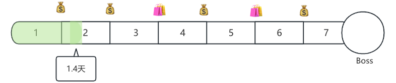

# 行动轴

> 术语已统一：行动轴节点是「放置来源的原子行动」，不再是独立的节点行动类型。详见 [行动系统](../游戏设计/行动.md)。

- 单局游戏持续多周(配置)，一周为一个阶段，以行动轴展示
- 在每一周，玩家不断进行**行动**n选一（随机来源的原子行动），决定下一个**行动**，并消耗对应天数
- 行动结束后，若到行动轴节点，会执行该节点上放置的原子行动

## 初始行动轴

- 一个七天的轴，在整天上可能会有特殊节点
- 进度条结束时，会进入下一周，或者游戏胜利
- 长度可能收到道具、角色、事件影响

## 节点（放置的原子行动）

### 节点上放置的原子行动，展示在行动轴上，常见行为如下

- Boss：带有特殊机制的**美食**（`behavior=Food`，难度 Boss）
- 收取利息：根据当前的金币数，每满n金币获得1金币（`behavior=Interest`）
- 进入商店：商店中有各种可出售物品（`behavior=Shop`）
- 等等：任意原子行动均可放置

### 执行顺序

- 在执行完行动后，若进度条前进的区域内有节点，会依次结算这些节点上放置的原子行动

### 行动轴随机

- 根据角色，预设多种行动轴库，根据权重进行随机
- 每种配置包含的节点行动（Boss除外）

### Boss随机

- 按权重随机，部分boss需要满足特殊条件解锁
- 根据角色，随机可能随机出来的boss
- 带有特殊机制
