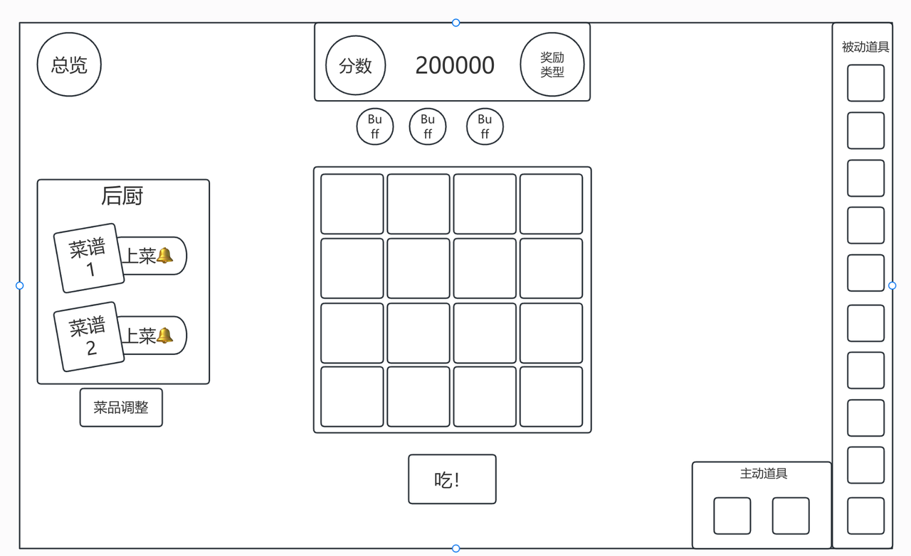
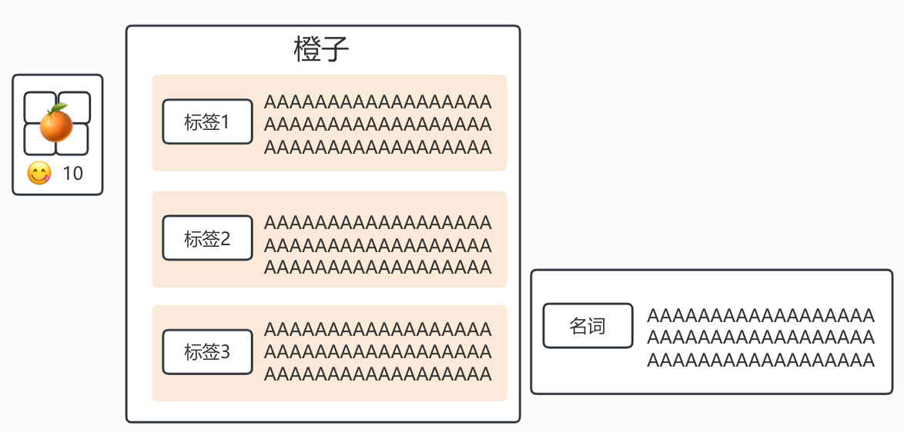

# 局内

> 来源：https://kbcineyoxn.feishu.cn/wiki/YiNKwcdPKi67iRkH2sWc07Khngc

局内
一、设计简介
目标
对玩家的构筑进行数值验证与机制验证（部分关卡有）
保持一定的随机性与策略性
介绍
食物具有空间概念，不同食物所占格子的情况不一样
玩家点击食谱，会随机出一个食物放入棋盘
玩家选择结算时，会按一定顺序，先结算标签（技能），再汇总分数
分数达到要求则过关

二、食物

属性
所占空间
每个食物都占一定空间，不一定规则
棋盘放的下此食物时，才有可能被随机到
方向也会随机，但是保证能放得下
基础分数（美味值）
技能结算时，以及分数结算会参与计算
风味
不同风味有不同效果
每个食物最多有一个风味，若再次获得，会替换原来的风味
特殊装饰品和消耗品可以解除只能存在单个风味的设定
技能
每种食物初始都有配置好的技能
单个食物拥有的技能数量无上限
食物的技能可以被添加、修改
风味与技能涉及到游戏专有名词时，需要额外展示
获得
初始食谱
初始会根据每个经营方向，设立一个初始食谱
初始食谱并非固定，开局前展示初始食谱可能包含的食物种类（部分食物需要解锁）
初始食谱会配置部分食谱为固定
其余可随机食物会分为多个小组。开局先按权重选择一套「各小组抽取数量数组」，再在各小组内按权重放回随机（部分食物会设定最多被随机的次数）。
食物库
纯配置的随机食物库
每个食物都有一个隐藏分范围，以及基础权重
取上下限为隐藏分均值
食物，食物带标签A，视为两个食物，拥有不同的隐藏分范围
随机食物：
每当需要一个食物展示给玩家选择或获得时，会根据当前的进度、事件修正、纯随机修正，确立一个要求隐藏分
去随机食物库中，查看隐藏分范围包括此要求隐藏分的食物，有概率被随机出来
每个食物权重为要求隐藏分a和隐藏分均值b差值的函数w=1000|a-b|/a
