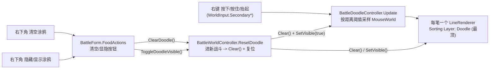

# 战斗涂鸦画笔 实现说明

仿《杀戮尖塔2》的局内自由涂鸦功能：玩家在战斗画面上用右键随手涂画，配右下角「清空」「显隐」两个按钮。纯表现，与玩法逻辑（`BattleSession`）完全解耦，不参与任何结算。

## 1. 功能需求

| 操作 | 行为 |
|---|---|
| 右键拖动 | 沿鼠标轨迹绘制矢量笔迹，压在棋盘 / 菜品 / 特效之上 |
| 右下角「清空涂鸦」 | 一键清空全部笔迹 |
| 右下角「隐藏/显示涂鸦」 | 切换涂鸦层显隐，按钮标签同步切换 |
| 进入新一局战斗 | 自动清空笔迹、复位为可见 |

约束：单一固定画笔（深墨色、固定线宽），不持久化、不参与分数结算。

## 2. 总体设计

把「涂鸦层」做成一个独立纯表现模块，复用工程既有三件套，接入点只有 `BattleWorldController.Initialize` 一处：

- 输入：复用 `WorldInput`（新版 Input System 封装），右键事件。
- 渲染顺序：新增最顶命名 Sorting Layer `Doodle`，压在所有战斗内容之上。
- 按钮：固定结构预置在 `BattleForm.prefab` 的屏幕空间 UI，由 `BattleForm` 调用世界侧涂鸦接口。
- 笔迹：每一笔一个 `LineRenderer`，矢量描边 + 采样点串联（非光栅笔刷，无分辨率依赖）。



## 3. 涉及文件

| 文件 | 改动 |
|---|---|
| `ProjectSettings/TagManager.asset` | 新增最顶 Sorting Layer `Doodle`（uniqueID 1633673481） |
| `Assets/GameMain/Scripts/Game/Presentation/Battle/BattleSorting.cs` | 新增常量 `public const string Doodle = "Doodle";` |
| `Assets/GameMain/Scripts/Game/Presentation/Battle/WorldInput.cs` | 新增 `SecondaryHeld`、`SecondaryReleasedThisFrame` |
| `Assets/GameMain/Scripts/Game/Presentation/Battle/BattleDoodleController.cs` | 新建：涂鸦核心控制器 |
| `Assets/GameMain/Scripts/Game/Presentation/Battle/BattleWorldController.cs` | 保留 `_doodle` 字段，提供 `ResetDoodle()` / `ClearDoodle()` / `ToggleDoodleVisible()` / `DoodleToggleLabel` |
| `Assets/GameMain/Scripts/Game/UI/Battle/BattleForm.cs` | `FoodActions` 四按钮接入美食态 UI，调用世界侧涂鸦接口 |
| `Assets/GameMain/Content/Prefabs/UI/BattleForm.prefab` | `HudFrame/FoodActions` 下预置 `Eat` / `Overview` / 涂鸦清空 / 涂鸦显隐按钮 |
| `Assets/GameMain/Content/Scenes/Battle.unity` | `BattleSceneRoot/DoodleRoot` 挂控制器；涂鸦按钮已迁出场景 |

## 4. 核心实现

### 4.1 渲染分层

涂鸦要盖在所有战斗内容（含 `PiecesFlying`）之上，故新增最顶层：

```
层级从后到前：Background → Board → Pieces → WorldUI → Fx → PiecesFlying → Doodle
```

笔迹通过 `BattleSorting.Apply(lineRenderer, BattleSorting.Doodle)` 归层。

### 4.2 输入封装（WorldInput）

右键的三态（按下/按住/抬起）封装在 `WorldInput`，禁止使用旧版 `Input.*`：

```csharp
public static bool SecondaryPressedThisFrame  => Mouse.current?.rightButton.wasPressedThisFrame ?? false;
public static bool SecondaryHeld              => Mouse.current?.rightButton.isPressed ?? false;
public static bool SecondaryReleasedThisFrame => Mouse.current?.rightButton.wasReleasedThisFrame ?? false;
```

屏幕→世界坐标用既有 `WorldInput.MouseWorld(camera)`（`ScreenToWorldPoint`，z 归零）。

### 4.3 涂鸦控制器（BattleDoodleController）

挂在 `Battle.unity` 的 `BattleSceneRoot/DoodleRoot` 上，`_camera` 指向 `BattleCamera`。所有笔迹挂在子物体 `Strokes` 下，便于整体清空 / 显隐。

固定画笔参数（常量）：

| 参数 | 值 | 说明 |
|---|---|---|
| `BrushColor` | `(0.15, 0.1, 0.08)` | 深墨色 |
| `BrushWidth` | `0.08` | 世界单位线宽 |
| `MinSampleDistance` | `0.05` | 采样最小间距（移动超过才追加点，避免点过密） |
| `CapVertices` / `CornerVertices` | `6` | 圆角线帽 / 拐角，让笔迹圆滑 |

`Update` 绘制流程：

- `SecondaryPressedThisFrame` 且可见 → **新建一笔**：`new GameObject("Stroke")` 挂 `LineRenderer`，`useWorldSpace = true`、共享材质 `Sprites/Default`、起止宽=`BrushWidth`、起止色=`BrushColor`、归入 `Doodle` 层，写入第一个采样点。
- `SecondaryHeld` 且有当前笔 → 取 `MouseWorld`，与上一点距离 > `MinSampleDistance` 才 `positionCount++` 追加点。
- `SecondaryReleasedThisFrame` → 结束当前笔；若只有 1 点（单击未拖动）补一个极小偏移点，用圆角线帽渲染成一个圆点。

公开接口：

| 成员 | 作用 |
|---|---|
| `Clear()` | 销毁 `Strokes` 下所有子物体（清空全部笔迹） |
| `SetVisible(bool)` | `Strokes.SetActive(visible)`；隐藏时中断当前笔并禁止新建 |
| `IsVisible` | 当前是否可见（供按钮刷新标签） |

> 材质用一张静态共享 `Material(Shader.Find("Sprites/Default"))`，URP 下纯色线正常显示（颜色走 `LineRenderer` 顶点色），避免重复创建。

### 4.4 UI 接入（BattleForm + BattleWorldController）

四个美食态按钮是**固定结构**（数量恒定），预置在 `BattleForm.prefab` 的 `HudFrame/FoodActions` 下，通过 `[SerializeField]` 引用，运行时只控制显隐、可交互状态与按钮文案。

```csharp
[SerializeField] private GameObject _foodActions;
[SerializeField] private Button _doodleClearButton;
[SerializeField] private Button _doodleToggleButton;
[SerializeField] private Text _doodleToggleText;
```

`BattleWorldController.Initialize` 末尾调用 `ResetDoodle()`：

- 每次进入战斗（含再战）执行 `_doodle.Clear()` + `_doodle.SetVisible(true)` + 复位标签为「隐藏涂鸦」，实现「进新战斗自动清空」。
- `BattleForm` 的清空按钮调用 `_world.ClearDoodle()`。
- `BattleForm` 的显隐按钮调用 `_world.ToggleDoodleVisible()`，再用 `_world.DoodleToggleLabel` 刷新标签。

`FoodActions` 只在 `GameplayView.Food` 显示，退出美食态时隐藏。

### 4.5 场景结构（Battle.unity）

```
Battle.unity
├── BattleCamera               (正交, z=-10)
└── BattleSceneRoot
    ├── BattleWorldController   (_doodle 已接)
    ├── DoodleRoot              (BattleDoodleController, _camera → BattleCamera)
    │   └── Strokes             (运行时生成的笔迹挂这里)
BattleForm.prefab
└── HudFrame
    └── FoodActions
        ├── EatButton / OverviewButton
        ├── DoodleClearButton
        └── DoodleToggleButton
```

四个按钮已迁到屏幕空间 UI，默认位置仅作占位，具体布局在 `BattleForm.prefab` 中调整。

## 5. 边界与未做项

- 不接入存档、不参与结算，跨场景 / 跨周不持久化。
- 单一固定画笔，暂不支持调色 / 切换线宽（后续要做需另加调色 UI）。
- 不支持撤销（Undo）。
- 右键被涂鸦占用；若后续要给棋子加「右键旋转」等操作，需重新规划输入分配。

## 6. 常见扩展点

| 需求 | 改动位置 |
|---|---|
| 改画笔颜色 / 线宽 | `BattleDoodleController` 的 `BrushColor` / `BrushWidth` 常量 |
| 笔迹更顺滑 / 更省点 | 调 `MinSampleDistance`、`CapVertices` / `CornerVertices` |
| 调按钮位置 | 在 `BattleForm.prefab` 调整 `HudFrame/FoodActions` 下的按钮 |
| 多色画笔 | `BattleDoodleController` 增加当前色字段 + 新增调色按钮（数据驱动则走运行时实例化） |
