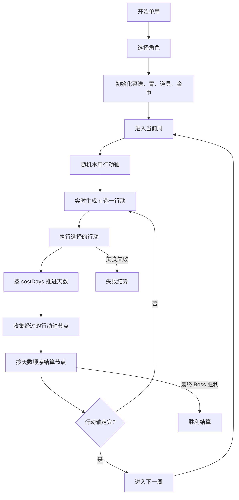

# 游戏设计

## 1. 核心定位

玩家在一局中以“周”为阶段单位推进。每周是一条行动轴，时间是主要局外行动资源；玩家每次从实时随机出的 n 个行动中选择 1 个执行（最多 3 个，候选不足时可以少于 3 个），行动消耗天数并推进 7 天游标。行动可能进入美食挑战、事件、奖励或商店；如果推进区间经过行动轴节点，则按天数顺序触发利息、商店、事件或 Boss。

局内核心是通过菜谱上菜，在胃部棋盘中摆放菜品并结算菜品标签、格子标签和道具效果。美食挑战达成目标分后获得金币、菜品、道具或胃部碎片等奖励；任意美食或 Boss 挑战失败则单局失败；最终周 Boss 胜利则单局胜利。

核心资源关系：

- 菜品：类似道具的构筑对象，提供形状、分数和标签。
- 菜谱：决定可被上菜随机系统抽取的菜品集合。
- 胃部棋盘：决定菜品摆放空间、格子标签和扩展边界。
- 道具：提供局级、上菜、标签结算、最终结算、奖励和商店阶段的修正。
- 金币：商店购买、刷新、编辑和删除菜品的通用货币。
- 隐藏分：控制目标分、菜品、道具、胃部碎片和商店商品的投放节奏。
- 行动轴：控制一周内的时间游标和特殊节点节奏。

## 2. 单局主循环



关键规则：

1. 一周对应一条行动轴，默认 7 天。
2. 每次行动选择必须是实时 n 选一（最多 3 个），不使用开局预生成行动序列。
3. 行动执行后先推进天数，再检测经过的节点。
4. 一次行动经过多个节点时，按行动轴从前到后的顺序依次结算。
5. 节点是系统节奏，不是行动本身；行动和节点都可以引导到事件、商店、美食或 Boss。
6. 美食挑战未达目标分立即失败。
7. 普通 Boss 胜利后立即进入下一周。
8. 最终周 Boss 胜利立即进入胜利结算。
9. 普通周行动轴走完后进入下一周。

## 3. 开始准备与角色

每个角色需要配置：

| 字段 | 说明 |
|---|---|
| 初始被动/主动道具 | 角色进入单局时自带的道具 |
| 初始菜谱 | 当前角色的初始菜谱配置 |
| 菜品随机池 | 当前角色可随机到的菜品集合，当前阶段可通过菜谱和解锁条件间接表达 |
| 道具随机池 | 当前角色可随机到的道具集合，当前阶段可通过特殊标记和解锁条件表达 |
| 初始胃部碎片 | 初始胃形状来源 |
| 胃部最大大小 | 最大长宽，影响可扩展边界 |
| 行动轴库 | 当前角色可随机到的行动轴集合，空表示全部 |
| Boss 池 | 当前角色可能遇到的 Boss 集合，空表示全部 |

进入单局时，先按角色初始化：

1. 初始菜谱和固定/随机菜品。
2. 初始胃部棋盘和最大扩展边界。
3. 初始道具。
4. 金币、周数、天数、行动次数和已触发记录。
5. 当前周行动轴。

## 4. 行动系统

### 4.1 行动模型口径

行动设计中的“行动组合 / 行动序列生成”不作为当前主循环实现口径。当前口径是：每次选择前从行动池实时筛选并按权重不放回随机 n 个行动，最多展示 3 个。行动设计中保留的内容是行动分类、难度、奖励意图、权重、前置条件和隐藏分修正。

行动至少包含：

| 字段 | 说明 |
|---|---|
| action_id | 行动唯一 ID |
| action_type | 行动类型：美食、事件、奖励、负面、商店等 |
| cost_days | 消耗天数 |
| weight | 实时 n 选一随机权重 |
| preconditions | 出现前置条件 |
| repeatable | 是否可重复出现；不可重复行动本周命中后不再进入池 |
| payload | 行动具体结算内容 |
| food_difficulty | 美食难度：普通、困难、Boss 等 |
| reward_kind | 美食胜利后的主奖励外观与奖励池类型 |
| reward_package | 美食胜利后的奖励包 |
| gold_curve | 金币奖励曲线 |
| hidden_score_bonus | 行动对隐藏分和目标分的额外修正 |

### 4.2 行动类型

行动从外观和奖励结果上分为：

- 美食（奖励金币）。
- 美食（奖励胃部碎片）。
- 美食（奖励被动道具）。
- 美食（奖励主动道具）。
- 美食（奖励菜品）。
- 更难美食（奖励金币 / 胃部碎片 / 道具 / 菜品）。
- 事件。
- 奖励。
- 负面事件。
- 商店。

美食行动的难度至少包含普通、困难、Boss。难度会参与目标分、金币范围和各奖励随机池隐藏分的计算。

### 4.3 行动随机

每次打开行动选择界面时：

1. 读取当前运行状态和角色。
2. 从行动表筛选满足前置条件的行动。
3. 排除本周已命中的不可重复行动。
4. 后续可扩展角色池、周池、难度池和事件池限制。
5. 按 `weight` 不放回随机最多 3 个；候选不足时展示 1/2 个。
6. 若无可选行动，允许休息行动作为兜底，消耗 1 天。

### 4.4 行动执行

行动执行顺序：

```text
选择行动
  ↓
创建 ActionExecutionContext
  ↓
根据 cost_days 推进当前天数
  ↓
记录本周行动次数和不可重复行动
  ↓
按 action_type 执行行动结果
  ↓
结算经过的行动轴节点
  ↓
回到 n 选一 / 进入下一周 / 结算胜负
```

行动执行结果：

| 类型 | 结果 |
|---|---|
| Food | 进入美食挑战，使用行动难度、奖励包、金币曲线和隐藏分修正生成目标与奖励 |
| Event | 打开指定事件，或由事件服务按权重随机事件 |
| Reward | 直接结算奖励或效果 |
| Negative | 直接结算负面效果 |
| Shop | 打开商店 |

## 5. 阶段与行动轴

### 5.1 行动轴

一周是一条行动轴。行动轴配置包含：

| 字段 | 说明 |
|---|---|
| timeline_id | 行动轴 ID |
| week_filter | 周筛选：普通周、Boss 周或指定周 |
| weight | 同一候选池中的随机权重 |
| base_length_days | 默认长度，通常为 7 天 |
| nodes | 特殊节点列表 |

行动轴随机规则：

1. 根据当前周是否 Boss 周和周序号做 `week_filter` 筛选。
2. 根据角色 `timelinePool` 筛选可用行动轴。
3. 按行动轴权重随机一条。
4. 运行态只保存当前行动轴 ID 和天数游标，读档时按配置重建节点。

### 5.2 节点

特殊节点展示在行动轴上，常见类型包括：

| 节点类型 | 说明 |
|---|---|
| Boss | 随机或指定 Boss，进入带特殊机制的美食挑战 |
| 利息 | 根据当前金币数，每满 N 金币获得若干金币 |
| 商店 | 进入商店购买、编辑菜谱、删除菜品 |
| 事件 | 随机或指定事件 |

节点结算规则：

- 行动从 `prevDay` 推进到 `newDay` 时，触发 `prevDay < node.day <= newDay` 的未触发节点。
- 同一次行动跨过多个节点时按 day 升序结算。
- 节点触发后写入已触发列表，读档后不重复结算。

## 6. 事件系统

事件配置要点：

| 配置项 | 说明 |
|---|---|
| 前置条件 | 满足条件后才进入随机池 |
| 权重 | 事件节点随机权重 |
| 权重序列 | 后续扩展；部分事件可随命中次数调整权重 |
| 是否可重复 | 不可重复事件命中后整局不再随机到 |
| 分类 | 奖励事件、负面事件、美食事件等 |
| 选项 | 玩家可选择的事件分支 |
| 结果 | 给予金币、菜品、道具、Buff、修改目标分等 |

事件执行流程：

```text
检查前置条件
  ↓
根据权重进入随机池
  ↓
展示事件文本与选项
  ↓
玩家选择选项
  ↓
执行对应结果
  ↓
更新局外状态
```

## 7. 美食系统

### 7.1 美食挑战

美食行动会进入局内挑战：

1. 根据周配置、行动难度、行动隐藏分、当前天数、行动次数、道具和事件修正生成目标分。
2. 玩家通过菜谱上菜并在胃部棋盘结算分数。
3. 分数大于等于目标分则挑战成功，进入奖励界面。
4. 分数低于目标分则单局失败。

美食行动建议字段：

| 字段 | 说明 |
|---|---|
| food_id | 美食或行动 ID |
| icon_type | 图标类型，依据固定奖励分类 |
| difficulty_variant | 难度变体 |
| target_score | 目标分数曲线或覆盖值 |
| reward | 达成奖励 |
| fail_condition | 失败条件，默认未达目标分 |

### 7.2 Boss

Boss 是特殊节点驱动的美食挑战。

Boss 随机规则：

1. 根据角色 `bossPool` 过滤。
2. 根据节点 `payloadParam` 过滤，可指定 Boss 池。
3. 根据 Boss 自身 `characterPool`、`week`、`unlockCondition` 过滤。
4. 按 Boss 权重随机。
5. Boss 可覆盖目标分曲线和特殊机制。

Boss 配置建议字段：

| 字段 | 说明 |
|---|---|
| boss_id | Boss ID |
| role_pool | 可出现角色池 |
| unlock_conditions | 解锁条件 |
| weight | 随机权重 |
| week | 出现周数或阶段 |
| food_config | Boss 对应的美食挑战配置 |
| special_mechanics | Boss 特殊机制 |

## 8. 分数、隐藏分与奖励

### 8.1 基础隐藏分

基础隐藏分用于统一控制局内难度和奖励投放节奏：

- 基础隐藏分 = f（游戏进度、行动加成、道具加成）。
- 游戏进度通常由周数、天数或行动序号决定。
- 行动加成来自行动类型、行动难度、事件结果或 Boss 机制。
- 道具加成来自被动道具、主动道具和特殊标签效果。
- 具体函数可以按进度分段配置。

### 8.2 派生隐藏分

不同系统基于基础隐藏分派生各自的要求值：

- 目标分 = f（基础隐藏分、行动加成、道具加成）。
- 菜品隐藏分 = f（基础隐藏分、行动加成、道具加成）。
- 被动道具隐藏分 = f（基础隐藏分、行动加成、道具加成）。
- 主动道具隐藏分 = f（基础隐藏分、行动加成、道具加成）。
- 胃部碎片隐藏分 = f（基础隐藏分、行动加成、道具加成）。

目标分用于美食挑战达标判断。菜品、道具和胃部碎片隐藏分用于筛选各自随机库中的候选项。所有派生函数都可以按进度分段，以便控制前中后期投放曲线。

### 8.3 局内奖励

局内奖励类型包括金币、三选一菜品、三选一被动道具、主动道具、三选一胃部碎片等。一般结构为：金币 + 一个主奖励 + 随机附加奖励。

金币规则：

- 金币一般都会发放，是购物、刷新等系统的通用货币。
- 金币上下限由美食难度和游戏进度共同决定。
- 在上下限范围内随机取值。
- 若奖励随机池完全为空，部分奖励可折算为金币，并输出配置警告。

非金币奖励规则：

- 菜品奖励使用菜品隐藏分随机。
- 被动道具奖励使用统一道具随机池，并接入道具隐藏分、来源品质分布和特殊标记筛选。
- 主动道具按来源和特殊标记随机，并受持有上限影响。
- 胃部碎片奖励使用胃部碎片隐藏分随机。
- 同时展示多个候选时不放回随机。

## 9. 菜品、菜谱与随机菜品

### 9.1 菜品属性

菜品是类似道具的构筑对象，主要属性包括：

- 占空间：以格子为基础的空间占据，不同菜品形状不同。
- 基础分数（美味度）：用于技能结算以及最终分数结算。
- 标签：每个菜品拥有的标签数不一定相同。

### 9.2 标签类型

- 固有标签：获得菜品时，若无额外条件，会获得带有固有标签的菜品。
- 唯一标签 A：每个菜品有 1 个上限，若再次获得唯一标签 A，会替换原来的标签。特殊道具可以解除上限设定。
- 唯一标签 B：规则同唯一标签 A。

标签涉及游戏专有名词时，需要额外展示说明。

### 9.3 初始菜谱

- 初始会根据每个角色设立一个初始菜谱。
- 初始菜谱会配置一些固定菜品。
- 初始菜谱中部分菜品并非固定，开局前展示初始菜谱可能包含的菜品种类，部分菜品需要解锁。
- 其余菜品会从可能包含的菜品种类中按权重放回随机，部分菜品会设定最多被随机的次数。
- 菜谱有一个要求初始分；随机池的每个 `RecipeEntry` 配置本菜谱内初始分。每次随机后判断已随机条目的初始分之和，若大于等于要求初始分，随机结束；若小于，则继续随机。
- `RecipeEntry` 格式为 `dishId,weight,maxCount,initScore`。初始分不属于菜品基础属性，同一道菜在不同菜谱里可以配置不同初始分。

### 9.4 菜品库与随机菜品

菜品库是纯配置的随机菜品库。每个菜品都有隐藏分范围、基础权重和价格；隐藏分均值取上下限均值。菜品的标签 A、标签 B 不同时，视为不同菜品，拥有不同的隐藏分范围。

每当需要一个菜品展示给玩家选择或获得时：

1. 根据当前进度、行动修正、事件修正、道具修正和随机修正，确立要求隐藏分。
2. 从菜品库中筛选隐藏分范围包含该要求隐藏分的菜品。
3. 每个菜品权重为要求隐藏分 `a` 和隐藏分均值 `b` 差值的函数：`w = 基础权重 / max(|a-b|, c)`。
4. 同时展示多个菜品时，不放回随机；若全部取完，则全部放回再随机。

## 10. 棋盘（胃）

### 10.1 大小

- 每个角色有一个固定的初始胃部大小，可能会根据菜谱变化。
- 每个角色都有一个胃部最大大小，设定为长 `n`、宽 `m`。

### 10.2 胃部碎片库

- 配置一个胃部碎片库。
- 碎片方向不允许旋转，例如 `1x2` 和 `2x1` 是两个碎片。
- 部分胃部碎片格可能带有强化标签，分开配置。
- 每个胃部碎片有自身权重、隐藏分范围和价格。
- 隐藏分均值取隐藏分上下限的均值。

### 10.3 随机胃部碎片

在需要展示或给玩家胃部碎片奖励时：

1. 检测玩家的最大胃部大小和当前胃部大小。
2. 若已达到最大胃部大小，将碎片按隐藏分分段线性折算为金币。
3. 若未达到最大胃部大小，从胃部碎片库中筛选可以放入当前胃部扩展范围、且隐藏分范围包含要求隐藏分的碎片。
4. 每个碎片权重为要求隐藏分 `a` 和隐藏分均值 `b` 差值的函数：`w = 基础权重 / max(|a-b|, c)`。
5. 同时展示 3 个但只有 2 个符合要求时，展示 2 个。
6. 如果经过筛选后仍随机不到，输出配置错误，提示策划排查。

### 10.4 扩展胃部

- 扩展胃部时通过 UI 直接限制玩家，若扩展后大于最大长宽，则不能扩展。
- 扩展胃部必须贴着原来的胃部扩展，不能分割开来。

## 11. 上菜与结算

### 11.1 上菜

1. 根据棋盘空位，筛选出可以被塞入棋盘的菜品。
2. 菜品允许 90 度任意翻转。
3. 根据权重，从可塞入棋盘的菜品中随机。权重正比于这些菜初始的格子数，也可以被道具等效果修正。
4. 每个菜只可以被上一次，除非有特定标签或道具效果。

### 11.2 标签结算

1. 若无特殊标签，按照从上到下、从左到右确立所有棋盘格的结算顺序。
2. 多个棋盘格为同一个菜品时，只在第一次结算菜品标签，格子可以结算多次。
3. 先结算菜品标签，再结算格子标签。

### 11.3 分数结算

若无特殊标签，按照从上到下、从左到右的顺序，把所有分数加合作为总分数。主动道具、被动道具、标签和 Boss 机制可以在最终结算前追加加法、乘法或达标修正。

## 12. 道具

### 12.1 术语

1. 道具定义：配置表中的静态数据，包含名字、描述、图标、类型、品质、特殊标记、权重、效果与上限。
2. 道具状态：单局运行中的持有数据。被动道具同一 id 唯一一份，用当前等级表示升级；主动道具同一 id 可持有多份，每份是一个独立实例。
3. 获得道具：把一个道具定义结算到道具状态上。被动道具表现为首次获得或升级；主动道具表现为新增一份实例，到达持有上限则折算金币或重抽。
4. 随机池：某次奖励、事件或商店刷新可被抽取的道具集合。所有随机都走统一筛选与权重，避免不同系统规则漂移。

### 12.2 被动道具

被动道具参数：

- 技能：具体能力是什么，由效果类型和参数描述。
- 品质：表征稀有度与投放节奏。
- 特殊标记：可能在某些事件、Boss 奖励或流派定向奖励中被随机到。
- 等级：等级有上限。越高效果越强，不一定只有数值变化，也可能有机制变化。
- 等级权重修正：已持有但未满级时，本道具的再次出现权重会被修正。
- 解锁条件：部分道具一开始不会解锁，需要满足指定条件。

被动道具触发：

- 构建战斗时：修改本局棋盘、菜谱、目标分、上菜次数等局级参数。
- 上菜前后：修改候选菜权重、额外生成菜、改变摆放结果。
- 标签结算前后：追加标签效果、修改某类菜的分值。
- 最终结算前：追加最终加法、乘法或达标修正。
- 奖励/商店刷新时：修改奖励池、价格、品质分布或额外选项。

### 12.3 主动道具

主动道具参数：

- 技能：具体能力是什么，由效果类型和参数描述。
- 特殊标记：可能在某些事件以及 Boss 奖励中被随机到。
- 触发时机：在某些阶段可以触发，例如上菜前、上菜后、吃之前、结算后、奖励界面。
- 持有上限：当前同时最多持有几份实例。
- 使用即移除：主动道具使用后该实例直接从持有列表移除。

主动道具 UI：

- 简单主动道具点击后立即生效，例如清空棋盘、额外上菜。
- 复杂主动道具点击后进入选择模式，例如选择一个菜、一个格子或一本菜谱。
- 不满足触发时机时置灰，并展示不可用原因。
- 同一 id 的多份实例在 UI 上聚合为一个槽，用角标 xN 表示份数。

### 12.4 统一随机规则

所有奖励、事件、商店都使用统一随机池。

筛选顺序：

1. 类型筛选：被动/主动。
2. 解锁筛选：未解锁的道具不进入池。
3. 来源筛选：特殊事件只允许指定特殊标记。
4. 隐藏分筛选：当来源配置要求道具隐藏分时，只保留隐藏分范围包含要求值的道具。
5. 上限筛选：被动满级、主动达到持有上限的道具不进入池。

权重计算：

- 基础权重来自配置。
- 品质分布由来源决定，例如普通奖励、Boss 奖励、商店、特殊事件。
- 若使用道具隐藏分，权重可叠加要求隐藏分和道具隐藏分均值差值的修正。
- 已持有被动但未满级时，乘以等级权重修正。

同时展示多个道具时，不放回随机。如果随机范围内没有道具：

- 先扩大到同来源的全部品质。
- 再没有时扩大到整个已解锁道具库。
- 仍然没有时折算为金币，并输出配置警告。

## 13. 商店系统

### 13.1 商店刷新

商店根据当前周、天数、行动上下文和隐藏分刷新商品。商店商品包括：

- 菜品。
- 主动道具。
- 被动道具。
- 胃部碎片。

商品建议字段：

| 字段 | 说明 |
|---|---|
| item_id | 商品 ID |
| item_type | 菜品 / 主动道具 / 被动道具 / 胃部碎片 |
| price | 价格 |
| hidden_score_range | 隐藏分区间 |
| weight | 随机权重 |
| stock | 库存 |

### 13.2 商店操作

玩家在商店中可以：

- 购买商品。
- 编辑菜谱。
- 删除菜品。
- 关闭商店并回到行动轴流程。

删除菜品需要花费金币。商店关闭后继续处理剩余行动轴节点；若没有剩余节点，则回到 n 选一行动。

## 14. 胜负与结算

### 14.1 胜利条件

完成最终周 Boss 后，游戏胜利。后续可进入无尽模式。

### 14.2 失败条件

任意一局美食或 Boss 挑战未完成目标分数，则游戏失败。

### 14.3 结算流程

```text
判定胜负
  ↓
展示胜负结果
  ↓
展示局内指标
  ↓
展示新解锁内容
  ↓
玩家确认
  ↓
返回主界面或开启新一局
```

结算页需要展示：

- 胜利 / 失败。
- 当前周数和当前天数。
- 击败 Boss 情况。
- 获得金币。
- 获得/使用菜品。
- 获得/使用道具。
- 获得胃部碎片。
- 触发事件数量。
- 新解锁内容。

## 15. 推荐工程模块拆分

```text
GameRun
  - 管理单局生命周期状态
  - 保存角色、周数、天数、金币、道具、菜品、胃部碎片和触发记录

ActionRandomService
  - 根据前置条件、权重、是否重复生成 n 选一行动（最多 3 个）
  - 后续扩展角色/难度/周池过滤与权重序列

ActionExecutor
  - 执行行动结果
  - 推进天数
  - 修改局外状态

TimelineService
  - 初始化行动轴
  - 推进行动轴
  - 检测经过节点
  - 提供节点数据

EventService
  - 事件随机
  - 展示事件
  - 执行事件选项结果

BossService
  - 根据角色池、节点池、周和解锁条件筛选 Boss
  - 按权重随机 Boss

FoodChallengeService / BattleForm
  - 处理美食挑战
  - 判断分数是否达标
  - 发放奖励或触发失败

ShopService
  - 根据隐藏分刷新商品
  - 处理购买、编辑菜谱、删除菜品

RewardService / RewardGranter
  - 统一发放金币、菜品、道具、胃部碎片等奖励

SettlementService
  - 生成胜负结算数据
  - 生成新解锁内容展示
```

## 16. 推荐核心状态结构

```ts
type RunState = {
  runId: string;
  characterId: string;
  seedText: string;

  currentWeek: number;
  currentDay: number;
  timelineId: string;
  timelineLengthDays: number;
  actionStepIndex: number;

  gold: number;
  requiredScoreOverride?: number;

  bonusDishIds: string[];
  stomachFragmentIds: string[];
  items: RunItemState[];

  triggeredNodeIds: string[];
  usedEventIds: string[];
  usedActionIds: string[];
  completedBossIds: string[];

  result?: "playing" | "win" | "lose";
};

type TimelineNode = {
  id: string;
  timelineId: string;
  day: number;
  nodeType: "boss" | "interest" | "shop" | "event";
  payloadValue?: number;
  payloadParam?: string;
};
```

## 17. 关键实现规则

1. 文档和实现以“7 天游标 + 实时 n 选一（最多 3 个）”为主口径。
2. 行动设计中的“行动组合/预生成序列”暂不实现；其分类、难度、权重和奖励意图落到 `action` 表。
3. 行动随机必须过滤前置条件、不重复限制和后续扩展的角色/难度限制。
4. 行动执行后先推进天数，再检查经过的行动轴节点。
5. 如果一次行动经过多个节点，应按节点在行动轴上的顺序依次结算。
6. 美食挑战未达目标分，立即失败。
7. 普通 Boss 胜利，立即进入下一周。
8. 最终周 Boss 胜利，立即胜利。
9. 商店商品根据隐藏分和权重随机。
10. 删除菜品需要扣除金币。
11. 结算时展示胜负、局内指标和新解锁内容。
