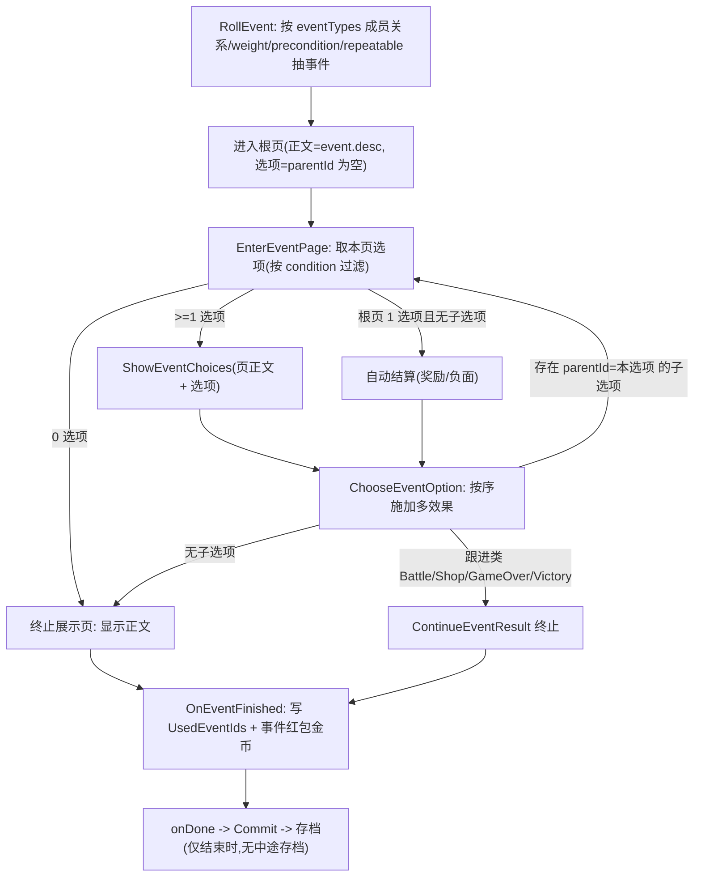

# 事件（页面树 / 两表）

> 拆分自 [游戏设计总览](../游戏设计.md)。相关：[行动系统](./行动.md)、[行动轴](./行动轴.md)。
>
> 事件不是独立顶层系统，而是三种「事件类行为」（`Event` / `Reward` / `Negative`）共用的**事件表**。行动通用字段、来源、执行路径见 [行动系统](./行动.md)。

## 定位

`Event` / `Reward` / `Negative` 三种行为的原子行动都是**薄壳**：执行时从事件池里按 `eventTypes` 分类列表随机抽一个具体事件再结算。同一事件可以属于多个池。

参考《杀戮尖塔2》，每个事件是一张**页面树**（tree），而不是「一层选项即结束」。但只用**两张表**表达，不额外拆「节点」表：

- **选项(option)** 既是「上一页的按钮」，被选中后又承载「下一页的正文 + 子选项」。
- 一张页 = 一段正文 + 一组选项。**根页**正文用 `TbEvent.desc`，选项是 `parentId` 为空的那些；**子页**正文用「引出它的那个选项」的 `resultText`，子选项是 `parentId` 指向该选项的那些。
- 于是可以任意深度：根选项 → （其 resultText 作子页正文）子选项 → … 直到某选项没有子选项即**终止**。

`preconditions` / `weight` / `repeatable` 是**事件公共字段**，抽取时统一过滤：满足前置、权重 > 0、可重复或本局未命中。用前置条件即可实现「先触发某些东西后才能随机到的事件」。

- `Event` 行动 → 从 Event / Reward / Negative 合并池抽事件（交互多选项）。
- `Reward` 行动 → 抽 `eventTypes` 包含 `Reward` 的事件（即时奖励，通常根页单选项自动结算）。
- `Negative` 行动 → 抽 `eventTypes` 包含 `Negative` 的事件（负面）。

`eventTypes` 在 Excel 中用 `|` 分隔，例如 `Event|Reward`。列表中的每个分类都会让事件加入对应事件池；同一事件在合并池中仍只出现一次。第一项是**主分类**，仅它决定 Event/Reward 权重加成、保底计数和触发反馈，因此顺序有意义。

## 两张表

### TbEvent（事件池条目 / 根）

| 字段 | 说明 |
|---|---|
| id | 事件 ID |
| name | 事件标题（作为各页标题） |
| desc | 事件描述 = **根页正文** |
| eventTypes | 有序分类列表（复用 `ActionBehavior`，Excel 用 `|` 分隔）；全部分类决定池成员关系，第一项是主分类 |
| preconditions | 出现前置条件 |
| weight | 随机权重（`<=0` 不进池） |
| repeatable | 是否可重复；`false` 命中后写入 `UsedEventIds`（整局级），本局不再抽到 |

### TbEventOption（选项 / 边 + 分支页，按 eventId + parentId 组织）

| 字段 | 说明 |
|---|---|
| id | 选项 ID |
| eventId | 所属事件 `TbEvent.id`（根选项靠它定位） |
| parentId | 父选项 `TbEventOption.id`；**空 = 根页选项** |
| text | 选项文本（按钮） |
| resultText | 选中后的结果正文；**有子选项时作为子页正文**；空则回退效果反馈 |
| condition | 逐选项前置条件（空=恒可见，复用行动前置语法，实现锁定/条件选项） |
| effectTypes / effectValues / effectParams | 选中时按序施加的效果（三条并列 list，可多效果；多行续写，前导列留空） |

`EffectType` 枚举涵盖即时效果（`GainGold` / `LowerReq` / `GainItem` / `Gamble` / `AddDish` / `UpgradeDish`）与跟进类（`FoodBattle` / `Shop` / `GameOver` / `Victory`）。即时效果由 `EffectResolver` 结算；跟进类为**终止分支**，转成后续动作（战斗/商店/结局）。

> 纯树：每个子页只有唯一父选项（不做「多个选项汇入同一子页」的 DAG 合流，需要时复制一份）。

## 选项数量约定

- **根页 0 选项**：只展示正文即结束（纯文本事件）。
- **根页 1 选项且无子选项**：自动结算，无需玩家点选（奖励/负面/即时事件）。
- **≥2 选项 / 子页**：玩家在中部卡片 UI 上 n 选一（与「行动 n 选一」共用同一套中部卡片 UI），执行所选分支，可能进入子页。

> 区分两种「选择」：行动 n 选 1 是在多个原子行动间选一个来推进；事件选项分支是选中某事件后在其页面树里逐页选择。

## 文本显示规则

选中选项后展示的页正文 / 终止提示 = `resultText` 与效果反馈的拼接：

- 两者都有 → 效果反馈在前、`resultText` 在后（换行）。
- 只有其一 → 取那一个。
- 都为空 → 回退当前页正文。

## 执行流程

## 示范：`ev_gamble`（纯玩家选择的多层树）

- 根页 `ev_gamble`（正文在 `TbEvent.desc`，选项 `parentId` 为空）：
  - 「稳妥点，小赌一把」→ `Gamble 30`，无子选项 → 结束。
  - 「上大注，豪赌一场」→ `Gamble 90` → 结束。
  - 「先观察一会儿…」（`opt_gamble_think`，无效果，`resultText`="邻座的老赌客压低声音…"）→ 有子选项 → 进入子页。
- 子页（选项 `parentId = opt_gamble_think`，正文=`opt_gamble_think.resultText`）：
  - 「听老赌客的，押他说的号」→ `Gamble 60` → 结束。
  - 「不信这套，转身离开」（无效果，`resultText`="你摆摆手离开了赌桌，什么也没发生。"）→ 无子选项 → 终止展示该 `resultText`。

## 改表流程

改 `GameConfig/Datas/event.xlsx`（`event` / `event_option` 两 sheet）后运行 `bash GameConfig/gen.sh` 重新生成 `Config/Gen/*.cs` 与 `StreamingAssets/Config/tbevent*.json`。事件多分类直接在 `eventTypes` 单元格写 `Event|Reward`；多效果用「并列 `*` 多行 list」写法（同 `week` 表 `*timelineIds`），单/零效果直接单格。
