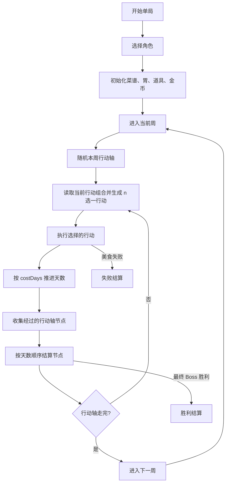

# 核心循环

> 拆分自 [游戏设计总览](../游戏设计.md)，对应原文档「1. 核心定位」「2. 单局主循环」。

## 核心定位

玩家在一局中以“周”为阶段单位推进。每周是一条行动轴，时间是主要局外行动资源；整局开始后按配置生成一条行动组合序列，玩家每次从当前行动组合给出的 n 个行动中选择 1 个执行（最多 3 个，候选不足时可以少于 3 个），行动消耗天数并推进 7 天游标。行动可能进入美食挑战、事件、奖励或商店；如果推进区间经过行动轴节点，则按天数顺序触发利息、商店、事件或 Boss。

局内核心是通过菜谱上菜，在胃部棋盘中摆放菜品并结算菜品标签、格子标签和道具效果。美食挑战达成目标分后获得金币、菜品、道具或胃部碎片等奖励；任意美食或 Boss 挑战失败则单局失败；最终周 Boss 胜利则单局胜利。

核心资源关系：

- 菜品：类似道具的构筑对象，提供形状、分数和标签。
- 菜谱：决定可被上菜随机系统抽取的菜品集合。
- 胃部棋盘：决定菜品摆放空间、格子标签和扩展边界。
- 道具：提供局级、上菜、标签结算、最终结算、奖励和商店阶段的修正。
- 金币：商店购买、刷新、编辑和删除菜品的通用货币。
- 隐藏分：控制目标分、菜品、道具、胃部碎片和商店商品的投放节奏。
- 行动组合序列：控制整局行动选择节奏、奖励外观和难度节奏。
- 行动轴：控制一周内的时间游标和特殊节点节奏。

## 单局主循环

关键规则：

1. 一周对应一条行动轴，默认 7 天。
2. 每次行动选择来自整局行动组合序列的当前行动组；组内候选按权重不放回随机，最多 3 个。
3. 行动执行后先推进天数，再检测经过的节点。
4. 一次行动经过多个节点时，按行动轴从前到后的顺序依次结算。
5. 节点是系统节奏，不是行动本身；行动和节点都可以引导到事件、商店、美食或 Boss。
6. 美食挑战未达目标分立即失败。
7. 普通 Boss 胜利后立即进入下一周。
8. 最终周 Boss 胜利立即进入胜利结算。
9. 普通周行动轴走完后进入下一周。
