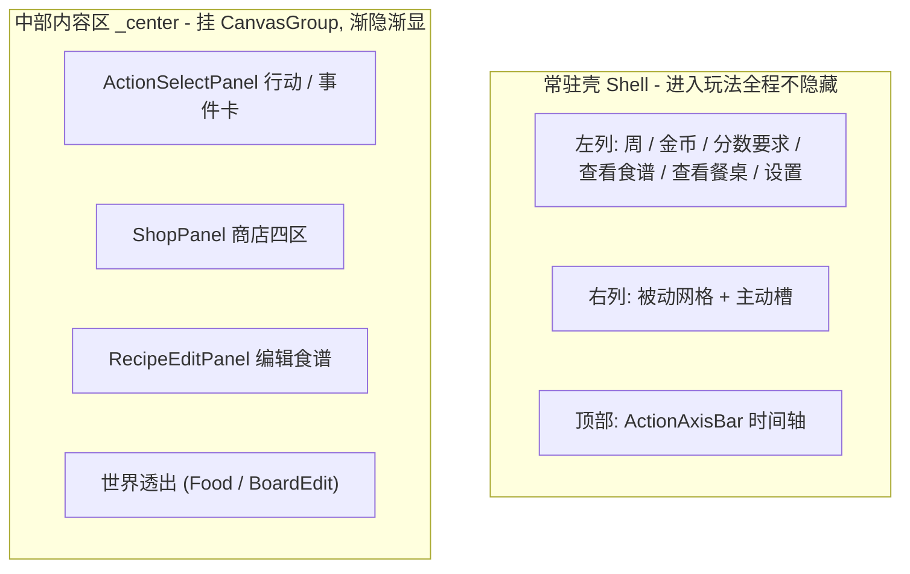
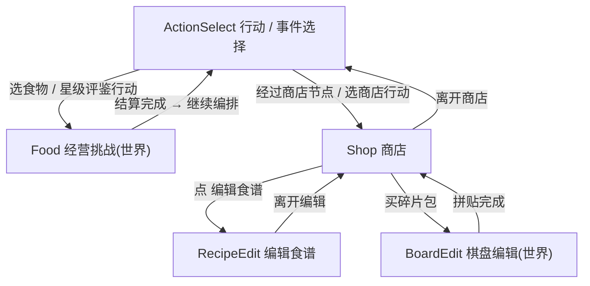
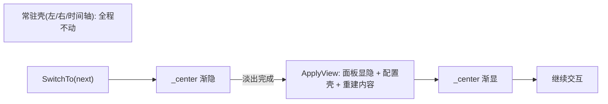

# 界面（局外 / 局内统一 UI）

> 依据 [原型图](../原型图) 落地的 UI 与交互设计。相关：[行动](./行动.md)、[时间轴](./时间轴.md)、[商店](./商店.md)、[食谱](./食谱.md)、[装饰品和消耗品](./装饰品与消耗品.md)、[棋盘](./餐桌.md)、[核心循环](./核心循环.md)。
>
> 参考原型：
> - [行动选择.png](../原型图/行动选择.png)
> - [时间轴事件页签.png](../原型图/时间轴事件页签.png)
> - [商店.png](../原型图/商店.png)
> - [商店-编辑食谱.png](../原型图/商店-编辑食谱.png)
> - 食物网格表现：[所有食物都以食物加背景网格的形式表.png](../原型图/所有食物都以食物加背景网格的形式展示.png)

## 0. 核心结论：一个常驻壳 + 中部多态（同一场景内完成）

局外全流程与局内经营挑战共用同一套**常驻壳**，进入玩法后常驻壳**全程不隐藏**，只有**中部内容区**在 `GameplayView` 各状态之间切换：

| 状态 `GameplayView` | 含义 | 载体 |
|---|---|---|
| `ActionSelect` | 行动 / 事件「n 选一」 | 屏幕空间 UI（中部卡片） |
| `Shop` | 商店四区 | 屏幕空间 UI |
| `RecipeEdit` | 编辑食谱 | 屏幕空间 UI（独立状态） |
| `Food` | 经营挑战 | Battle 世界场景（世界空间棋盘 + 食物） |
| `BoardEdit` | 棋盘编辑（拆碎片包后手动拼贴） | Battle 世界场景 |

**所有状态切换都在同一套场景内完成，没有场景过场。** `Launch.unity` 常驻，`Battle.unity` 叠加加载（见 `ProcedureGameplay`）。世界场景（`Battle.unity` 的 `BattleWorldController`）承载「经营挑战」和「棋盘编辑」；「商店 / 行动选择 / 编辑食谱」都是叠在上层的屏幕空间 UI。切换 = 中部 UI 面板显隐 + 世界内容显隐 + DOTween 局部渐隐渐显，全程不加载 / 卸载场景。



各状态切换的时机由周循环编排驱动（见 [核心循环](./核心循环.md)）：



## 1. 目标美味值层：常驻壳 Shell + 中部内容区 Center

prefab 层级（`BattleForm.prefab`）：

```text
BattleForm
└─ HudFrame                       ← 进入玩法后常驻（仅开局前 / 结算返回菜单时整体隐藏）
   ├─ Center (CanvasGroup)        ← 中部内容区，切换动画只作用于它（对应 _center）
   │  ├─ ShopPanel  (嵌套 ShopForm.prefab，内含 RecipeEditPanel 子树)
   │  └─ CenterContent            ← 行动 / 事件卡容器（Title / CardsContainer / SkipButton）
   ├─ TopAxis   (ActionAxisBar)   ← 常驻壳：时间轴
   ├─ LeftColumn                  ← 常驻壳：左列信息 + 查看食谱/餐桌 + 系统按钮
   ├─ RightColumn                 ← 常驻壳：右列装饰品和消耗品
```

关键点：

- **常驻壳**（`LeftColumn` / `RightColumn` / `TopAxis`）是 `HudFrame` 的直接子节点，**不在** `Center` 之下，因此切换动画（对 `_center` 做渐隐渐显）**不会**波及它们 —— 这同时满足「左右列常驻」与「切换动画干净」。
- **中部内容区** `Center` 挂 `CanvasGroup`（对应 `BattleForm._center`），是唯一的渐隐渐显动画区；行动 / 事件卡（`CenterContent`）、商店四区（`ShopPanel`）、编辑食谱（`RecipeEditPanel`，物理上位于嵌套 `ShopForm` 子树内，但由 `BattleForm` 状态机作为独立状态驱动）、世界透出都在这个根下切换。
- `HudFrame` 只在**开局前**（`OnInit` → `HideHud`）与**结算返回菜单前**（`ShowRunResult` → `HideHud`）整体隐藏；**五态之间切换时它始终显示**，所以左右列在玩法全程常驻。

### 1.1 左列（信息 + 系统按钮）

从上到下（对应 `BattleForm` 左列 `SerializeField` 字段）：

| 元素 | 内容 | 说明 | 现有字段 |
|---|---|---|---|
| 周次 | `第 x/5 周` | 无尽模式显示 `无尽 第 n 关` | `_weekText` |
| 金币 | `💰 200` | 全局货币 | `_goldText` |
| 分数要求 | `当前 / 要求` | 非经营挑战态显示 `- / 要求分`，经营挑战态显示实时预览分 | `_scoreReqText` |
| 查看食谱 | 按钮 | 打开中部只读食谱页；再次点击或点返回回到原状态 | `_viewRecipeButton` |
| 查看餐桌 | 按钮 | 打开餐桌只读预览；预览中按钮显示“返回” | `_viewTableButton` |
| 设置 | 按钮 | 打开设置界面 | `_settingsButton` |

左列在玩法各状态全程常驻，仅显示内容随态更新（`RefreshPersistent`）。

### 1.2 顶部时间轴（进度条）

时间轴用**进度条**表现一周的天数游标与特殊节点，对应 `ActionAxisBar`（`Assets/GameMain/Scripts/Game/UI/Hud/ActionAxisBar.cs`）：

- 按当前时间轴长度铺 N 个**天格**，分「已过 / 未来」视觉态。
- 特殊节点叠加**节点标记**：商店 / 利息 / Boss / 事件（数据来自 `TimelineService.GetNodes`）。
- **当前位置三角标**指向下一步将执行的天格；下方显示**剩余天数文字**。

时间轴在 `ActionSelect` / `Shop` 态显示；`RecipeEdit` / `Food` / `BoardEdit` 态**隐藏**（`ApplyView` 里 `SetActionAxisVisible(actionSel || shop)`）。

### 1.3 右列（装饰品和消耗品）

从上到下（对应 `RefreshItems` / `RefreshActiveItems`）：

- **装饰品网格**：2 列，最多 10 格。同 id 唯一一份，边框用品质色。
- **消耗品槽**：固定 2 槽在底部。同 id 多实例聚合为一槽，用 `xN` 角标表示份数（见 [装饰品和消耗品](./装饰品与消耗品.md)）。

点击装饰品和消耗品槽弹出装饰品和消耗品详情；经营挑战态下满足触发时机的消耗品点击即使用（见第 5 节）。右列**五态全程常驻**。

### 1.4 食谱查看

BattleForm 不再保留底部固定食谱卡。左列 `ViewRecipe` 是常驻入口，点击后切换到中部
`RecipeInspect`，由 `RecipeReadonlyBookView` 展示唯一食谱；从经营挑战态打开时使用
`BattleSession` 的剩余食物快照。

### 1.5 各态壳元素显示矩阵

| 元素 | `ActionSelect` | `Shop` | `RecipeEdit` | `Food` | `BoardEdit` |
|---|---|---|---|---|---|
| 左列信息 + 系统按钮 | 常驻 | 常驻 | 常驻 | 常驻 | 常驻 |
| 右列装饰品和消耗品 | 常驻 | 常驻 | 常驻 | 常驻 | 常驻 |
| 顶部时间轴 | 显示 | 显示 | 隐藏 | 隐藏 | 隐藏 |
| 中部：行动 / 事件卡 | 显示 | — | — | — | — |
| 中部：商店四区 | — | 显示 | — | — | — |
| 中部：编辑食谱 | — | — | 显示 | — | — |
| 中部：世界透出 | — | — | — | 显示 | 显示 |
| 全屏白底 `_backdrop`（可选） | 开 | 开 | 开 | 关 | 关 |

> `_backdrop` 为可选的中部白底，默认未接线（世界态靠禁用中部面板让世界相机透出即可）；若需要在非世界态盖一层不透明底，可把全屏 Image 接到 `BattleForm._backdrop`，`ApplyView` 会按「世界态关、其余态开」自动切换。

## 2. 行动选择态 `ActionSelect`（含事件 n 选一）

参考 [行动选择.png](../原型图/行动选择.png)。中部展示当前行动组的 n 选一行动，对应 `BattleForm.ShowActionSelection` / `BuildActionCards`。**事件「n 选一」与行动选择共用同一套中部卡片 UI**（见 2.4）。

### 2.1 布局与交互

- 中部并排铺 **n 个（最多 3 个）行动卡**；候选不足时按 1 / 2 个居中展示（`SpawnCard` 按归一化 [minX,maxX] 布局）。
- 无可选行动时展示 `休息` 兜底按钮（`_skipButton` → `OnActionSelectionPicked(null)`）。
- 点击某张行动卡 → 淡出中部、交回编排执行（推进天数、触发节点、可能开战），对应 `_loop.OnActionPicked`。
- 行动候选每次进入界面按整局行动序号确定性随机并快照，读档不重抽（`RollChoices` + `ActionScheduleService.GenerateChoices`）。

### 2.2 行动卡结构

对应 `WeekEventCardView`（`Assets/GameMain/Scripts/Game/UI/Meta/WeekEventCardView.cs`），单卡从上到下：标题、美术图、奖励装饰品和消耗品图 + `!` 预告（可选）、耗时 `用时 x 天`。

### 2.3 行动 / 事件卡美术变体清单

原型要求页签背景是**具有特殊设计的卡面美术**（类似卡牌游戏），不能是粗糙按钮底。

行动类型（引自 [行动](./行动.md)）：

| 卡面 | 对应行动类型 | 备注 |
|---|---|---|
| 食物·金币 | 食物（奖励金币） | |
| 食物·餐桌格 | 食物（奖励餐桌格） | |
| 食物·装饰品 | 食物（奖励装饰品） | |
| 食物·消耗品 | 食物（奖励消耗品） | |
| 食物·食物 | 食物（奖励食物） | |
| 更难食物 | 更难食物 | 共用「困难」底框 + 奖励角标区分 |
| 事件 | 事件 | |
| 奖励 | 奖励 | |
| 负面事件 | 负面事件 | |
| 商店 | 商店 | 与节点商店卡面可复用 |

时间轴节点行动（参考 [时间轴事件页签.png](../原型图/时间轴事件页签.png)）：

| 卡面 | 说明 | 卡内展示 |
|---|---|---|
| 商店 | 节点商店 | 标题 `商店` + 美术图 + 底部 `节点行动` 标签 |
| 收取利息 | 利息节点 | 标题 `收取利息` + 效果描述 + `节点行动` |
| 周末星级评鉴（恶魔） | 星级评鉴节点 | 标题 `周末星级评鉴 / 恶魔` + 美术图 + 技能描述框 + `节点行动` |

美术命名 / 尺寸约定：

- 卡面美术遵守 [food-asset-style](../../../.cursor/rules/food-asset-style.mdc)：食品主视觉为**纯食品**，无五官 / 表情 / 拟人。
- 建议命名 `card_action_<type>` / `card_node_<type>`。

卡面总数（定稿）：**行动卡 10 套 + 节点卡 3 套 = 13 套**（节点商店卡与行动商店卡可复用，实际可少 1 套）。

### 2.4 事件「n 选一」统一到中部卡片

事件不再走独立 `ConfirmDialog` 弹层，而是**与行动选择共用中部卡片 UI**：

- `WeekLoopController.ResolveEvent` 的多选项分支调用 `IWeekLoopView.ShowEventChoices(title, desc, options, onPick)`（`ApplyEventOption` 逻辑不变，只换触发 UI）；纯通知类（无选项）仍走 `ShowNotice`。
- `BattleForm.ShowEventChoices` 把事件名 / 描述作为中部标题（`_centerTitleText`），每个选项铺一张事件卡（`WeekEventCardView.BindEventOption`），点击回调选项序号（`OnEventOptionPicked`），经 `SwitchTo(ActionSelect)` 淡入。

## 3. 商店态 `Shop`

参考 [商店.png](../原型图/商店.png)。左右壳与时间轴常驻，中部为商品购买区和删除食物服务区；食谱从左列 `ViewRecipe` 进入。对应 `ShopForm`（`Assets/GameMain/Scripts/Game/UI/Meta/ShopForm.cs`）。

**`ShopForm` 已瘦身为商店购买区**：编辑食谱抽出为独立状态 `RecipeEditPanel`（第 4 节），`ShopForm` 负责食物 / 碎片包 / 装饰品/消耗品四区，以及独立的删除食物服务区与入口回调。

### 3.1 中部购买区

| 区块 | 内容 | 说明 |
|---|---|---|
| 食物购买 | 3 个固定食物槽 | 参考 STS2 的预放 Holder + `FillSlot`：节点不动态生成，仅按槽位索引绑定库存；卡片保持固定尺寸 |
| 棋盘碎片包 | 固定商品卡 | 不动态生成节点；购买餐桌格后进入 `BoardEdit` 态手动拼贴 |
| 装饰品购买 | 2 个固定装饰品和消耗品槽 | 预放 Slot，按槽位索引绑定库存，不动态生成节点 |
| 消耗品购买 | 2 个固定装饰品和消耗品槽 | 预放 Slot，按槽位索引绑定库存，不动态生成节点 |
| 删除食物服务 | 固定服务装饰品和消耗品卡 | 不动态生成节点；显示动态价格，点击购买后进入食谱选择，确认目标时扣费并删除 |

库存按「周 + 天」key（`GameRun.BuildShopKey`）在内存 pending 复用：同日再进沿用同一份，不即时存档，离开商店结算时统一存。

### 3.2 食谱入口

- BattleForm 不再常驻显示固定食谱卡；统一由左列 `ViewRecipe` 按钮打开中部 `RecipeReadonlyBookView`。
- 商店购买的食物直接加入唯一食谱，不再选择目标食谱；购买飞行动画落到左列 `ViewRecipe` 按钮。
- 删除食物等目标选择仍复用中部食谱页，由 `RecipeBookCoordinator` 区分只读、删除和消耗品选菜流程。

### 3.3 离开商店

- `离开商店` 按钮 → `ShopForm` 回调 `onLeave` → `BattleForm.OnShopLeave`（隐藏商店面板）→ `OnShopClosed`，回到周循环编排继续处理剩余节点 / 回到行动选择。

## 4. 编辑食谱态 `RecipeEdit`（独立状态）

参考 [商店-编辑食谱.png](../原型图/商店-编辑食谱.png)。**已从 `ShopForm` 抽出为独立状态**，由 `BattleForm` 状态机驱动，对应 `RecipeEditPanel`（`Assets/GameMain/Scripts/Game/UI/Meta/RecipeEditPanel.cs`）。全屏盖住中部与时间轴，左右壳仍常驻。

### 4.1 布局

- **顶部提示**：删除食物至垃圾桶 / 拖拽移动。
- **中部食谱区**：展示唯一食谱仓库（`_warehouseContainer` 铺一个 `RecipeWarehouseView`），固定 12 格宽并按可用宽度等比适配；食物自动紧凑排布，仓库只向下延伸并支持纵向拖动浏览。
- **底部**：垃圾桶（`RecipeTrashDropZone`，拖入删除、花金币 `ShopService.DeleteDishCost`）+ `离开编辑` 按钮（回调 `onExit` → 返回商店态）。

### 4.2 交互

- **拖拽整理**：调整唯一食谱内的食物顺序（`ShopService.MoveDish`）。
- **拖拽删除**：食物拖到垃圾桶删除（`ShopService.DeleteDishAt`，花金币）。
- 每次编辑后 `onChanged` 回调刷新常驻壳金币（`RefreshShopPersistent`）。
- `离开编辑` → `SwitchTo(Shop)` 返回商店态。

> 状态归属：`RecipeEditPanel` 节点物理上位于嵌套 `ShopForm.prefab` 的子树内，但它挂独立组件、对外暴露 `Open(run, onExit, onChanged)`，由 `BattleForm` 作为**独立中部态**驱动（`ApplyView` 里单独显隐 + 配置壳），与商店态解耦。

## 5. 经营挑战态 `Food` / 棋盘编辑态 `BoardEdit`（世界场景）

同一 `Battle.unity` 世界场景内表现，对应 `BattleWorldController`。中部世界棋盘透出（禁用中部 UI 面板 / 关白底），时间轴按状态配置。

### 5.1 与其它态的差异

- **保留**：左右常驻壳。
- **去掉**：顶部时间轴、商店 / 编辑面板。
- **中部**：世界空间棋盘（`BattleWorldController`）透出；食谱详情仍通过左列 `ViewRecipe` 进入中部只读页。

### 5.2 交互（`Food`）

- 从世界空间出菜口上菜；`BuildBattleControls` 负责绑定出菜、弃置与拖拽回调。点击 `ViewRecipe` 可查看本局剩余食物。
- 左列分数要求显示**经营挑战实时值**（`_session.PreviewScore()` / `RequiredScore`）。
- 右列消耗品满足触发时机时点击即使用；否则点击看信息。
- `吃` → 结算棋盘分数，达标胜利、不达标失败（见 [核心循环](./核心循环.md)、[上菜结算](./上菜结算.md)）。

### 5.3 交互（`BoardEdit`）

- 由商店购买碎片包触发（`OpenBoardEdit` → `world.BeginBoardEdit`），在世界棋盘手动拼贴碎片。
- 完成后 `OnBoardEditDone` → 隐藏世界 → `SwitchTo(Shop)` 回到商店。

## 6. 食物在界面中的网格表现

参考 [所有食物都以食物加背景网格的形式表.png](../原型图/所有食物都以食物加背景网格的形式展示.png)。

- 所有食物 / 食物 sprite 在食谱、编辑食谱、商店食物格中，都以「**食物 + 背景网格**」形式呈现，背景网格直观表达该食物的**占格形状**。
- 食物按格子**原生尺寸**生成 / 整理（遵守 [food-asset-style](../../../.cursor/rules/food-asset-style.mdc)）：`1x1` = `512x512`、`2x1` = `1024x512`、`2x2` = `1024x1024`。
- 食品为纯食品，无五官 / 表情 / 拟人。

## 7. 现有实现映射与待补项

### 7.1 常驻壳

- `BattleForm` 已具备左列 / 右列 / `ActionAxisBar`，且 prefab 已把它们移出 `Center`、进入玩法后常驻。
- 左列 `ViewRecipe` 与 `ViewTable` 分别接入中部只读食谱页和餐桌预览。

### 7.2 时间轴

- `ActionAxisBar.Build` 已铺天格、标注节点、定位三角标。
- **待补**：节点标记改为**图标美术**、三角标下方**剩余天数文字**。

### 7.3 行动 / 事件选择态

- `BuildActionCards` + `WeekEventCardView` 已实现行动 n 选一；事件已统一到中部卡片（`ShowEventChoices` / `BindEventOption`）。
- **待补**：按类型的**卡面美术背景**（见 2.3）、奖励装饰品和消耗品图 + `!` 预告。

### 7.4 商店态

- `ShopForm` 已瘦身为四区 + `编辑食谱` / `离开商店` 入口回调。
- **待补**：四区布局与原型对齐、定价 / 刷新数值细化。

### 7.5 编辑食谱态

- 已抽出为独立 `RecipeEditPanel`（拖拽整理、拖入垃圾桶删除、`离开编辑` 返回商店），由状态机驱动。

### 7.6 食物 / 棋盘世界态

- `Food` / `BoardEdit` 已在同一 Battle 场景透出世界棋盘、按矩阵配置壳，无重大差异。

## 8. 页面切换的局部过程动画（DOTween）

因为五态**共享同一套常驻壳**，切换时壳始终在屏幕上不动。切换动画是**局部的过程动画**（只对中部内容区做渐隐渐显），**不是**全屏场景过场。动画栈统一用 **DOTween**（核心 API，走 unscaled 时间）。

核心约定：**常驻壳不参与动画**；切换 = 中部旧内容**渐隐** → 交换内容(swap) → 中部新内容**渐显**。



### 8.1 切换中枢：`SwitchTo` + `UITransition.FadeSwap`

- `BattleForm.SwitchTo(GameplayView next, Action buildCenter = null)`：同步置状态标志（`_current` / `_inBattle`），然后 `UITransition.FadeSwap(_center, () => ApplyView(next, buildCenter))`。
- `ApplyView`（在淡出完成后执行）集中做：切换中部面板显隐（`ActionSelect`/`Shop`/`RecipeInspect` 等面板互斥）+ 配置壳（时间轴显隐 / `_backdrop` 白底 / 世界透出）+ 重建内容（行动卡 / 事件卡 / 商店 / 食谱页 / 世界棋盘）。
- `UITransition`（`Assets/GameMain/Scripts/Game/UI/Common/UITransition.cs`）：

```csharp
// 对 region 淡出 → swap → 淡入；region 为 null 或时长<=0 时立即 swap（直切，功能与动画解耦）。
Tween FadeSwap(CanvasGroup region, Action swap,
               float fadeOut = 0.12f, float fadeIn = 0.15f, Action onDone = null);
Tween Fade(CanvasGroup region, float target, float duration);
```

- `region` 只包住中部内容区 `_center`，绝不包住常驻壳。
- `swap` 把「隐藏旧面板 + 启用新面板 + 重建内容 + 配置壳」收敛成一个回调，在**淡出完成后**执行。
- 时长 <= 0（或 region 为 null）时立即 `swap`（直切），功能与动画解耦、可独立开发；用 `SetUpdate(true)`（unscaled）与 `DOTween.Kill` 防叠加。

### 8.2 逐切换点落点

| 切换 | 入口 | 落点 |
|---|---|---|
| → `ActionSelect` | `OpenWeekMap` → `ShowActionSelection` | `SwitchTo(ActionSelect, {设标题 + BuildActionCards})` |
| → 事件 n 选一 | `ShowEventChoices` | `SwitchTo(ActionSelect, {设事件标题 + BuildEventCards})` |
| → `Shop` | `OpenShop` | `SwitchTo(Shop)`；`ApplyView` 里 `ShopForm.Open(...)` |
| → `RecipeEdit` | 商店 `编辑食谱` → `OpenRecipeEdit` | `SwitchTo(RecipeEdit)`；`ApplyView` 里 `RecipeEditPanel.Open(...)` |
| `RecipeEdit` → `Shop` | `离开编辑` → `OpenShopFromEdit` | `SwitchTo(Shop)` |
| → `Food` | `StartBattle` | `SwitchTo(Food)` + `world.Initialize` |
| → `BoardEdit` | 买碎片包 → `OpenBoardEdit` | `SwitchTo(BoardEdit, {world.BeginBoardEdit})` |
| `BoardEdit` → `Shop` | `OnBoardEditDone` | 隐藏世界 → `SwitchTo(Shop)` |

### 8.3 常驻壳内部的自身动画（也走 DOTween）

- 商店购买食物的视觉副本飞向左列 `ViewRecipe` 按钮；动画完成不再刷新固定食谱计数卡。
- `WeekEventCardView` 入场 / 隐藏 / 选中：`transform.DOScaleY`（`Ease.OutBack` 入场、`Ease.InQuad` 收拢）+ `DOTween.Sequence`（选中先 hold 再收拢后回调）。边缘特效（粒子迸发、glow 渐变）暂保留协程 / `Update`，作为后续清理项。

### 8.4 DOTween 接入说明

- 动画全部基于 **DOTween 核心 API**（`DOTween.To` / `DOTween.ToAlpha` / `DOVirtual.Float` / `Transform.DOScaleY` / `Sequence`）。核心 `DOTween.dll` 是自动引用的托管插件，`GourmetProject.Game` 无需改 asmdef 即可用。
- 未使用需要 `DOTween.Modules` asmdef 的 UI 扩展方法（`CanvasGroup.DOFade` / `RectTransform.DOAnchorPos`），改用等价的 `DOTween.To` 表达 —— 以此规避 `overrideReferences` 下手写 Modules asmdef（需精确列出 `UnityEngine.UI` 等 precompiledReferences）的编译脆弱性。

### 8.5 何时才用全屏过场 `CartoonSceneTransitionForm`

仅用于**真正切换 Unity 场景 / GameFramework 流程**、常驻壳本身也整体消失重来的场合：

| 场合 | 是否全屏过场 |
|---|---|
| 主菜单 ⇄ 选角 ⇄ 进入局内场景 | 是 |
| 局内 → 返回菜单 | 是 |
| 常驻壳内的五态切换（行动 / 商店 / 编辑 / 食物 / 棋盘） | 否，用 8.1 的中部渐隐渐显 |

### 8.6 硬性约定

- 常驻壳（左 / 右 / 时间轴）**不参与页面切换动画**，全程保持在屏。
- 页面切换只对**中部内容区 `_center`** 做局部过程动画。
- 动画走 DOTween、unscaled、回调式，允许任意时长；内容交换集中在 `swap`（`ApplyView`），必须在**淡出完成后**执行。
- 不接动画时默认直切（时长 <= 0 立即 `swap`），功能与动画解耦。
- 全屏过场只留给真正的场景 / 流程切换（见 8.5），不用于常驻壳内的五态切换。
