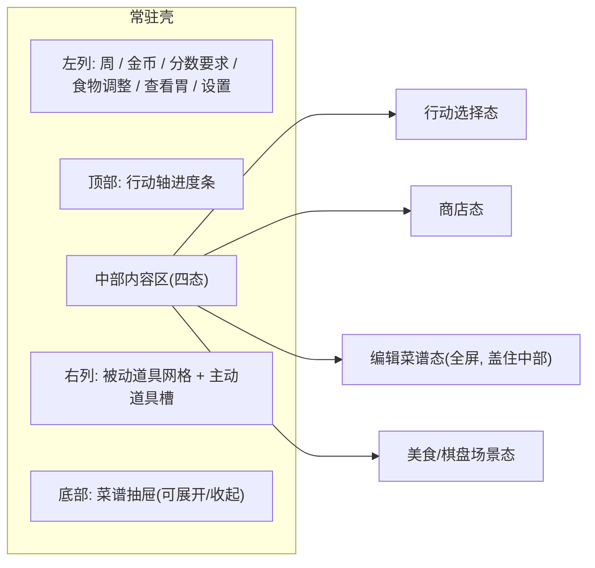
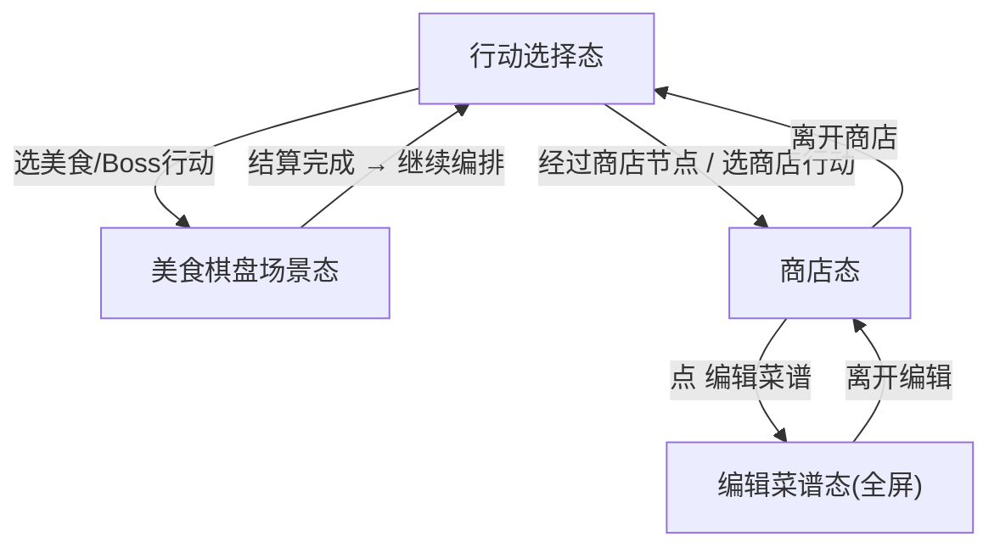
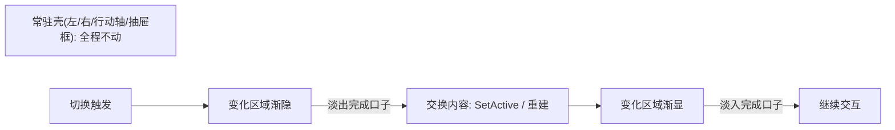

# 界面（局外 / 局内统一 UI）

> 依据 [原型图](../原型图) 落地的 UI 与交互设计。相关：[行动](./行动.md)、[行动轴](./行动轴.md)、[商店](./商店.md)、[菜谱](./菜谱.md)、[道具](./道具.md)、[棋盘](./棋盘.md)、[核心循环](./核心循环.md)。
>
> 参考原型：
> - [行动选择.png](../原型图/行动选择.png)
> - [行动轴事件页签.png](../原型图/行动轴事件页签.png)
> - [商店.png](../原型图/商店.png)
> - [商店-编辑菜谱.png](../原型图/商店-编辑菜谱.png)
> - 菜品网格表现：[所有菜品都以菜品加背景网格的形式表.png](../原型图/所有菜品都以菜品加背景网格的形式表，要用来表现其网格的特性.png)

## 0. 核心结论：一个常驻壳 + 中部四态

局外全流程与局内战斗共用同一套**常驻壳**，只有**中部内容区**在四种状态之间切换。这与现有 `BattleForm`（`Assets/GameMain/Scripts/Game/UI/Battle/BattleForm.cs`）架构一致：常驻壳字段（左列 / `ActionAxisBar` / 中部 / 右列 / `RecipeDrawer`）已经就位，中部内容态由 `ShowActionSelection` / `ShowBattleHud` 等方法切换。



四态切换的时机由周循环编排驱动（见 [核心循环](./核心循环.md)）：



## 1. 常驻壳

常驻壳分为四块：左列（信息 + 系统按钮）、顶部行动轴、右列（道具）、底部菜谱抽屉。以下为四块的布局与交互口径，并标注对应的现有实现。

### 1.1 左列（信息 + 系统按钮）

从上到下（对应 `BattleForm` 左列 `SerializeField` 字段）：

| 元素 | 内容 | 说明 | 现有字段 |
|---|---|---|---|
| 周次 | `第 x/5 周` | 无尽模式显示 `无尽 第 n 关` | `_weekText` |
| 金币 | `💰 200` | 全局货币 | `_goldText` |
| 分数要求 | `当前 / 要求`（如 `0 / 0`） | 非战斗态显示 `- / 要求分`，战斗态显示实时预览分 | `_scoreReqText` |
| 食物调整 | 剩余次数（如 `2`） | 本局可调整食物的次数（数值逻辑另见玩法文档） | `_foodAdjustText` |
| 查看胃 | 按钮 | 打开胃部空间预览（当前为占位提示，见第 7 节） | `_viewStomachButton` |
| 设置 | 按钮 | 打开设置界面 | `_settingsButton` |

左列在**四态全程常驻**，仅显示内容随态更新。

### 1.2 顶部行动轴（进度条）

行动轴用**进度条**表现一周的天数游标与特殊节点，对应 `ActionAxisBar`（`Assets/GameMain/Scripts/Game/UI/Hud/ActionAxisBar.cs`）：

- 按当前行动轴长度 `TimelineLengthDays` 铺 N 个**天格**（原型示例 7 格）。
- 天格分「已过 / 未来」两种视觉态（`day <= CurrentDay` 为已过）。
- 特殊节点在对应天格上叠加**节点图标**：商店（🛍）、利息（💰 金币袋）、Boss（😈 恶魔）、事件。节点数据来自 `TimelineService.GetNodes`。
- **当前位置三角标**指向「下一步将执行」的天格中心（`markerIndex = CurrentDay`）。
- 三角标下方显示**剩余天数文字**（原型 `1.6天`）。

行动轴在行动选择态、商店态常驻；**美食棋盘场景态隐藏行动轴**（见第 5 节）。

### 1.3 右列（道具）

从上到下（对应 `RefreshItems` / `RefreshActiveItems`）：

- **被动道具网格**：2 列，最多 10 格。同 id 唯一一份，等级 > 1 时右上角 `Lv.x` 角标，边框用品质色。
- **主动道具槽**：固定 2 槽在底部。同 id 多实例聚合为一槽，用 `xN` 角标表示份数（见 [道具](./道具.md)）。

点击道具槽弹出道具详情；战斗态下满足触发时机的主动道具点击即使用（见第 5 节）。右列**四态全程常驻**。

### 1.4 底部菜谱抽屉

菜谱抽屉可展开 / 收起，对应 `RecipeDrawer`（`Assets/GameMain/Scripts/Game/UI/Hud/RecipeDrawer.cs`），有三种配置态：

| 抽屉态 | 触发 | 表现 | 对应方法 |
|---|---|---|---|
| 收起（可展开） | 行动选择态默认 | 底部只留一条 `展开菜谱` 按钮；点击展开查看菜谱 | `ConfigureCollapsible(false)` |
| 展开（可收起） | 商店态 / 手动展开 | 展开显示各菜谱条，可再点 `收起菜谱` | `ConfigureCollapsible` + 手动展开 |
| 锁定展开 | 美食棋盘场景态 | 强制展开，隐藏收起按钮，接上菜交互 | `ConfigureLockedOpen` |

进入行动选择态时，若之前处于展开态会**自动收缩**回收起态（原型说明「进入行动选择状态时自动收缩」）。

### 1.5 各态壳元素显示矩阵

| 元素 | 行动选择态 | 商店态 | 编辑菜谱态 | 美食棋盘态 |
|---|---|---|---|---|
| 左列信息 + 系统按钮 | 常驻 | 常驻 | 常驻 | 常驻 |
| 右列道具 | 常驻 | 常驻 | 常驻 | 常驻 |
| 顶部行动轴 | 显示 | 显示 | 隐藏（全屏盖住） | **隐藏** |
| 中部行动卡 | 显示 | — | — | — |
| 中部商店四区 | — | 显示 | — | — |
| 中部世界棋盘 | — | — | — | 显示 |
| 底部菜谱抽屉 | 收起（可展开） | 展开 | 提升为全屏 n 本菜谱 | 锁定展开 |
| 菜谱：可购买空菜谱 | — | 显示 | — | **不显示** |
| `编辑菜谱` 按钮 | — | 显示 | — | **不显示** |
| `离开商店` 按钮 | — | 显示 | — | **不显示** |
| `离开编辑` 按钮 | — | — | 显示 | — |

## 2. 行动选择态

参考 [行动选择.png](../原型图/行动选择.png)。中部展示当前行动组的 n 选一行动，对应 `BattleForm.ShowActionSelection` / `BuildActionCards`。

### 2.1 布局与交互

- 中部并排铺 **n 个（最多 3 个）行动卡**；候选不足时按 1 / 2 个居中展示。
- 无可选行动时展示 `休息` 兜底按钮（消耗 1 天，对应 `_skipButton` → `OnActionSelectionPicked(null)`）。
- 点击某张行动卡 → 关闭行动选择、交回编排执行（推进天数、触发节点、可能开战），对应 `_loop.OnActionPicked`。
- 行动候选每次进入界面按整局行动序号确定性随机并快照，读档不重抽（见 [行动](./行动.md)「行动随机」；实现 `RollChoices` + `ActionScheduleService.GenerateChoices`）。

### 2.2 行动卡结构

对应 `WeekEventCardView`（`Assets/GameMain/Scripts/Game/UI/Meta/WeekEventCardView.cs`），单卡从上到下：

- **标题**：行动 / 事件名（如 `奖励` / `饱餐一顿` / `事件`）。
- **美术图**（`<美术图>`）：卡面主视觉，按类型有独立美术（见 2.3）。
- **奖励道具图 + `!` 提示**（可选）：如原型「饱餐一顿」卡底部的圆形「奖励道具图」加红色 `!`，用于预告主奖励。
- **耗时**：`用时 x 天`（对应 `choice.CostDays`）。

### 2.3 行动 / 事件卡美术变体清单

原型要求页签背景是**具有特殊设计的卡面美术**（类似卡牌游戏，不同卡牌不同美术），不能是粗糙按钮底。需要以下卡面各一套：

行动类型（引自 [行动](./行动.md) 第 47–58 行）：

| 卡面 | 对应行动类型 | 备注 |
|---|---|---|
| 美食·金币 | 美食（奖励金币） | |
| 美食·胃部碎片 | 美食（奖励胃部碎片） | |
| 美食·被动道具 | 美食（奖励被动道具） | |
| 美食·主动道具 | 美食（奖励主动道具） | |
| 美食·菜品 | 美食（奖励菜品） | |
| 更难美食 | 更难美食（奖励金币 / 碎片 / 道具 / 菜品） | 共用同一「困难」底框 + 奖励角标区分（不按奖励类型拆多套） |
| 事件 | 事件 | |
| 奖励 | 奖励 | |
| 负面事件 | 负面事件 | |
| 商店 | 商店 | 与节点商店卡面可复用 |

行动轴节点事件（参考 [行动轴事件页签.png](../原型图/行动轴事件页签.png)，三态）：

| 卡面 | 说明 | 卡内展示 |
|---|---|---|
| 商店 | 节点商店 | 标题 `商店` + 美术图 + 底部 `节点事件` 标签 |
| 收取利息 | 利息节点 | 标题 `收取利息` + 效果描述（`每有5枚金币，获得1枚，最高可获得8枚`）+ `节点事件` |
| 周末盛宴（恶魔） | Boss 节点 | 标题 `周末盛宴 / 恶魔` + 美术图 + 技能描述框 + `节点事件` |

美术命名 / 尺寸约定：

- 卡面美术遵守 [food-asset-style](../../../.cursor/rules/food-asset-style.mdc)：食品主视觉为**纯食品**，无五官 / 表情 / 拟人。
- 建议命名 `card_action_<type>`（如 `card_action_food_gold`）、`card_node_<type>`（如 `card_node_shop` / `card_node_interest` / `card_node_boss`）。

卡面总数（定稿）：**行动卡 10 套 + 节点卡 3 套 = 13 套**（节点商店卡与行动商店卡可复用，实际美术产出可少 1 套）。

## 3. 商店态

参考 [商店.png](../原型图/商店.png)。左右壳与行动轴常驻，中部为购买区，底部菜谱抽屉展开。对应 `ShopForm`（当前实现与原型布局差异较大，见第 7 节）。

### 3.1 中部四区

| 区块 | 内容 | 说明 |
|---|---|---|
| 食物购买 | 4 个食物格，各 `💰 20` | 购买菜品（食物） |
| 棋盘碎片包 | 1 个碎片包，`💰 20` | 购买胃部碎片（见 [棋盘](./棋盘.md)） |
| 被动道具购买 | 3 个圆槽，各 `💰 20` | 购买被动道具 |
| 主动道具购买 | 3 个圆槽，各 `💰 20` | 购买主动道具 |

> 具体购买 / 定价 / 刷新数值逻辑本次**暂不实现**，仅定义 UI 布局与交互框架；商品刷新口径见 [商店](./商店.md)。

### 3.2 底部菜谱（展开态）

- 商店态下菜谱抽屉为**展开态**，横向展示当前持有的各本菜谱（原型示例每本显示 `10/12` 容量）。
- 末尾额外有一本**可购买的空菜谱**（`+ 💰 20`），用于扩充角色配置；**最多购买至 4 本菜谱**（含初始）。
- 左侧 `编辑菜谱` 按钮 → 进入编辑菜谱态（第 4 节）。

### 3.3 离开商店

- `离开商店` 按钮 → 关闭商店，回到周循环编排继续处理剩余节点 / 回到行动选择（对应 `ShopForm.OnLeaveClicked` → `BattleForm.OnShopClosed`）。
- 库存按「周 + 天」key 持久化，离开后同日再进沿用同一份库存，避免反复进出刷新（见 `ShopForm` 注释）。

## 4. 编辑菜谱态（全屏）

参考 [商店-编辑菜谱.png](../原型图/商店-编辑菜谱.png)。由商店态 `编辑菜谱` 按钮进入，为**全屏页**盖住中部与行动轴，但左右壳仍常驻。

### 4.1 布局

- **顶部提示**：`删除食物至垃圾桶`（顶栏）、`拖拽食物可移动至其他菜谱`（副提示）。
- **中部菜谱区**：并排 n 本菜谱，每本：
  - 右上角显示容量 `已放 / 上限`（原型示例 `10/12`）。
  - 菜品格区：2 列纵向排布，每格放一个菜品。
  - 菜品以**菜品 + 背景网格**表现其占格特性（见第 6 节）。
- **底部**：垃圾桶（拖入删除，`💰 20`）+ `离开编辑` 按钮（返回商店态）。

### 4.2 交互

- **拖拽移动**：将菜品从一本菜谱拖到另一本菜谱（跨菜谱移动）。
- **拖拽删除**：将菜品拖到垃圾桶，花费金币删除该菜品。
- `离开编辑` → 返回商店态（第 3 节）。

## 5. 美食 / 棋盘场景态

无原型，依需求说明推导。参考商店态壳，去掉商店购买元素与行动轴，中部换为棋盘。对应 `BattleForm.ShowBattleHud` / `BattleWorldController`。

### 5.1 与其它态的差异

- **保留**：左右常驻壳（左列信息 + 系统按钮、右列道具）、底部菜谱抽屉。
- **去掉**：顶部行动轴、商店购买四区、`离开商店` / `编辑菜谱` 按钮、可购买的空菜谱。
- **中部**：世界空间棋盘（`BattleWorldController`），关闭全屏白底（`_backdrop`）让世界棋盘透出。

### 5.2 交互

- 进入场景菜谱抽屉**自动展开并锁定**（`ConfigureLockedOpen`），每本菜谱一条，点击从该菜谱上菜（触发世界空间上菜动画，`BuildBattleRecipe` → `ServeFromRecipe`）。
- 左列分数要求 / 食物调整显示**战斗实时值**（`_session.PreviewScore()` / `RequiredScore`）。
- 右列主动道具满足触发时机时点击即使用；否则点击看信息。
- `吃` → 结算棋盘分数，达标胜利、不达标失败（见 [核心循环](./核心循环.md)、[上菜结算](./上菜结算.md)）。

## 6. 菜品在界面中的网格表现

参考 [所有菜品都以菜品加背景网格的形式表.png](../原型图/所有菜品都以菜品加背景网格的形式表，要用来表现其网格的特性.png)。

- 所有菜品 / 食物 sprite 在菜谱、编辑菜谱、商店食物格中，都以「**菜品 + 背景网格**」形式呈现，背景网格用于直观表达该菜品的**占格形状**（见 [菜品](./菜品.md)「所占空间」）。
- 菜品按格子**原生尺寸**生成 / 整理（遵守 [food-asset-style](../../../.cursor/rules/food-asset-style.mdc)）：
  - `1x1` = `512x512`
  - `2x1` = `1024x512`
  - `2x2` = `1024x1024`
- 食品为纯食品，无五官 / 表情 / 拟人。

## 7. 现有实现映射与差异 / 待补项

逐态列出「原型目标 ↔ 现有实现 ↔ 差异 / 待补」，便于后续开发对齐。

### 7.1 常驻壳

- 现有 `BattleForm` 已具备左列（周 / 金币 / 分数要求 / 食物调整 / 查看胃 / 设置）、右列（被动网格 + 主动槽）、`ActionAxisBar`、`RecipeDrawer` 字段与刷新逻辑。
- **待补**：`查看胃` 当前为占位提示（`OnViewStomachClicked` → `ShowNotice("查看胃", ...)`），需接入胃部空间预览界面。

### 7.2 行动轴

- `ActionAxisBar.Build` 已铺天格、标注节点（当前为**文字 label**：`BOSS` / `利息` / `商店` / `事件`）、定位当前三角标。
- **待补**：节点改为**图标美术**（商店 / 金币袋 / 恶魔）、三角标下方的**剩余天数文字**（原型 `1.6天`）。

### 7.3 行动选择态

- `BattleForm.BuildActionCards` + `WeekEventCardView` 已实现 n 选一逻辑与卡片数据绑定，但 `WeekEventCardView` 目前为**纯文本**（名称 / 描述 / 耗时）。
- **待补**：按类型的**卡面美术背景**（见 2.3 变体清单）、奖励道具图 + `!` 预告。

### 7.4 商店态

- `ShopForm` 现为「通用 stock 买区 + 卖 / 删道具区」布局，与原型「食物 / 碎片包 / 被动 / 主动 分区 + 空菜谱购买 + 编辑入口」差异较大。
- **待补**：按四区重排布局、`棋盘碎片包`、底部**可购买空菜谱**（上限 4 本）、`编辑菜谱` 入口。

### 7.5 编辑菜谱态

- **缺失**：当前无独立编辑菜谱页。需新建全屏页，实现拖拽跨菜谱移动、拖入垃圾桶删除（花金币）、`离开编辑` 返回商店。

### 7.6 美食棋盘场景态

- `BattleForm.ShowBattleHud` 已基本符合：关闭 `_backdrop` 透出世界棋盘、`ConfigureLockedOpen` 锁定菜谱、隐藏行动选择、左列接战斗真值。
- 与目标态一致，无重大差异。

### 7.7 切换过渡

- 现有四态切换是**直切**：`BattleForm.ShowActionSelection` / `ShowBattleHud` / `OpenShop` 直接 `SetActive` + 重建内容，中间没有过程动画口子。
- 因为四态共享**常驻壳**（左列 / 右列 / 行动轴 / 菜谱抽屉外框），切换时壳不动，**只有中部内容区**在换 —— 所以四态切换用**局部渐隐渐显**（对变化区域做过程动画），不需要全屏场景过场。
- 全屏过场 `CartoonSceneTransitionForm` 仅保留给**真正的场景 / 流程切换**（进入局内场景、返回菜单），不用于常驻壳内的四态切换。
- **待补**：给中部内容区（及其它会变化的局部元素）挂 `CanvasGroup`，预留渐隐渐显口子（详见第 9 节）。

## 9. 页面切换的局部过程动画与口子

因为四个页面 / 场景**共享同一套常驻壳**（左列 / 右列 / 行动轴 / 菜谱抽屉外框），切换时壳始终在屏幕上不动。所以切换动画是**局部的过程动画**（对真正变化的那部分 UI 做渐隐渐显 / 位移等），**不是**用 `CartoonSceneTransitionForm` 盖住全屏的场景过场。本节只约定「哪些区域会变、动画挂在哪、预留什么口子」。

核心约定：**常驻壳不参与动画**；切换 = 旧内容**渐隐** → 交换内容(swap) → 新内容**渐显**。每个会变化的区域各自独立做过程动画，互不影响常驻壳。



### 9.1 哪些是「常驻壳」，哪些是「变化区域」

| 分区 | 切换时是否动画 | 说明 |
|---|---|---|
| 左列（信息 + 系统按钮） | 常驻不动 | 数值变化可选做单独的数字滚动 / 高亮，不参与页面切换动画 |
| 右列（道具） | 常驻不动 | 新增 / 移除道具槽可选做单槽淡入淡出，不参与页面切换动画 |
| 顶部行动轴 | 常驻不动（美食态整体隐藏时可单独淡出） | 天数推进 / 三角标移动是自身的过程动画 |
| 菜谱抽屉外框 | 常驻不动 | 展开 / 收起是抽屉自身的过程动画（高度 / alpha） |
| **中部内容区** | **主要动画区** | 行动卡 / 商店四区 / 世界棋盘之间切换，做渐隐渐显 |

### 9.2 口子设计：给变化区域挂 CanvasGroup + 通用淡入淡出

给每个变化区域一个 `CanvasGroup`（中部内容根、以及需要单独动画的子区域），过程动画统一走一个通用工具，默认无动画时立即 swap（等于现在的直切）。

预留入口（设计签名，待实现）：

```csharp
// 通用局部过程动画：对某个区域淡出 → swap → 淡入。duration<=0 时立即执行 swap（直切）。
void FadeSwap(CanvasGroup region, Action swap, Action onDone = null,
              float fadeOut = 0.12f, float fadeIn = 0.15f);

// 中部四态切换封装（BattleForm 内新增）：只对中部内容根 _centerGroup 做 FadeSwap，壳不动。
void SwitchCenter(Action swap, Action onDone = null);
```

- `region`：只包住**变化区域**（如中部内容根），绝不包住常驻壳。
- `swap`：把每处切换里「隐藏旧内容 + 构建新内容」（`SetActive` / 重建卡片 / `Refresh...`）收敛成一个回调，在**淡出完成后**执行。
- 不接动画时 `FadeSwap` 直接 `swap()` 并回调 `onDone`，功能与动画解耦、可独立开发。

需要预留的 `CanvasGroup`（挂在对应根节点上）：

| CanvasGroup | 覆盖的变化区域 |
|---|---|
| `_centerGroup` | 中部内容根（行动卡容器 / 商店四区 / 世界棋盘覆盖层的公共父节点） |
| `_recipeContentGroup` | 菜谱抽屉展开内容（展开 / 收起过程动画，已有 `RecipeDrawer._content` 可加） |
| 单槽（可选） | 右列道具槽、行动卡单卡的入场错峰淡入 |

### 9.3 逐切换点的口子落点（局部动画）

| 切换 | 现有落点 | 局部动画口子 |
|---|---|---|
| → 行动选择态 | `BattleForm.ShowActionSelection` | `SwitchCenter(swap)`：`swap` = 显示行动选择面板 + `BuildActionCards`；壳与行动轴不动 |
| → 美食棋盘态 | `BattleForm.ShowBattleHud` / `StartBattle` | `SwitchCenter(swap)`：`swap` = 关 `_backdrop` 透出世界棋盘 + 锁定菜谱；仅中部淡换，壳保留 |
| → 商店态 | `BattleForm.OpenShop` → `ShopForm` | 中部换成商店四区做 `SwitchCenter`；底部菜谱抽屉自身展开动画 |
| 商店 ⇄ 编辑菜谱 | `编辑菜谱` / `离开编辑`（待新建页） | 编辑菜谱为提升到全屏的抽屉：对菜谱区域做淡入淡出（可加轻微位移），壳仍在 |
| 菜谱抽屉展开 / 收起 | `RecipeDrawer.SetExpanded` | 对 `_recipeContentGroup` 做高度 + alpha 过程动画（现为瞬时 `SetActive`） |
| 行动轴推进 / 三角标移动 | `ActionAxisBar.Build` / `PositionMarker` | 天格状态与三角标位置做补间，属自身过程动画 |
| 弹层开合（发奖 / 事件 / 详情 / 设置） | `GameApp.UI.OpenUIForm(...)` | 弹层自带打开 / 关闭动画（`UGuiForm.OnOpen`/`OnClose`），与本节局部动画独立 |

### 9.4 何时才用全屏过场 `CartoonSceneTransitionForm`

仅用于**真正切换 Unity 场景 / GameFramework 流程**、常驻壳本身也要整体消失重来的场合：

| 场合 | 是否全屏过场 |
|---|---|
| 主菜单 ⇄ 选角 ⇄ 进入局内场景 | 是（沿用现有 `CartoonSceneTransitionData.SceneAssetName` + `OnCovered`/`OnFinished`） |
| 局内 → 返回菜单 | 是（`GameplayFlowSignal.RequestReturnToMenu` 消费处包一层） |
| 常驻壳内的四态切换（行动 / 商店 / 编辑 / 美食） | 否，用第 9.2 的局部渐隐渐显 |

### 9.5 硬性约定（供实现遵守）

- 常驻壳（左 / 右 / 行动轴 / 抽屉外框）**不参与页面切换动画**，全程保持在屏。
- 页面切换只对**中部内容区**（及少量单独标注的变化元素）做局部过程动画。
- 动画区域用 `CanvasGroup.alpha`（可叠加位移 / 缩放）实现淡入淡出，走**回调 / 异步**，允许任意时长。
- 内容交换逻辑集中在一个 `swap` 回调，必须在**淡出完成后**执行。
- 不接动画时默认直切（`swap` 立即执行），功能与动画解耦、可独立开发。
- 全屏过场只留给真正的场景 / 流程切换（见 9.4），不用于常驻壳内的四态切换。
