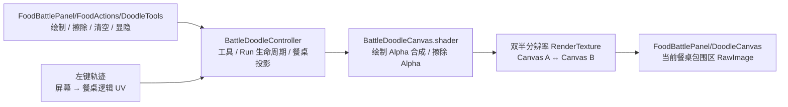

# 经营挑战涂鸦画笔 实现说明

经营挑战涂鸦采用《杀戮尖塔 2》同类的离屏画布方案：玩家选择绘制或擦除工具后，用左键拖动画线；笔迹先合成到餐桌逻辑网格对应的 `RenderTexture`，再由 `BattleForm.prefab/FoodBattlePanel` 中的 `RawImage` 一次显示。

涂鸦是纯表现功能，与分数结算完全解耦，不写入存档。同一个 `GameRun` 内跨多场经营挑战保留；结算只隐藏，下一场经营挑战按新餐桌布局重新显示。新建 `GameRun` 或玩家手动清空时才真正清除。

## 1. 功能

| 操作 | 行为 |
|---|---|
| 点击羽毛笔图标 | 进入绘制模式；左键拖动绘制深墨色笔迹；再次点击取消 |
| 点击橡皮图标 | 进入擦除模式；左键拖动局部擦除已有笔迹；再次点击取消 |
| 点击扫帚图标 | 清空整张涂鸦画布 |
| 点击眼睛图标 | 隐藏或重新显示涂鸦，不删除内容 |
| 点击结算 | 退出工具并隐藏画布，不删除内容 |
| 同一轮经营进入下一场挑战 | 保留画布、恢复显示、默认不选择工具 |
| 新开一轮经营 | 清空画布、恢复显示、默认不选择工具 |

绘制和擦除是互斥的单选工具。启用期间不再锁定其他 UI；点击涂鸦工具栏以外的按钮会自动退出当前工具。清空和显隐仍可在工具启用时直接使用，不会作为“其他按钮”触发退出。

图标沿用 STS2 资源：

- `drawing_quill(.png/_glow.png)`：绘制；选中时使用蓝色高亮。
- `drawing_eraser(.png/_glow.png)`：擦除；选中时使用红色高亮。
- `drawing_clear.png`：清空。
- `drawing_visibility.png`：从 STS2 `ui_atlas_1.png` 的 `peek_button` 区域裁出的眼睛图标；隐藏时降低透明度。

## 2. 架构



### 为什么使用双 RenderTexture

同一张纹理不能安全地同时作为采样源和渲染目标。每加入一段轨迹时，shader 从当前画布读取旧颜色，写入另一张画布，然后交换 A/B：

1. 绘制：新笔刷覆盖旧画布，并按直通 Alpha 重新合成 RGB。
2. 擦除：保留 RGB，按笔刷覆盖率削减画布 Alpha。
3. 显示：`RawImage` 永远引用刚写完的当前画布。

完整画布按 `DiningTable.Width × DiningTable.Height` 的稳定逻辑网格建立，目标密度为 64 像素/格，最长边封顶 2048。当前餐桌只通过 `RawImage.uvRect` 显示存在格包围区对应的子区域，因此扩格只改变投影范围，不改变旧笔迹的逻辑 UV，也不会在餐桌 Tween 期间反复重建纹理。

## 3. 运行时流程

`BattleDoodleController.Update` 只在画布可见且已选择工具时处理左键：

- 按下：在起点压一个圆点。
- 按住：把上一帧鼠标位置和当前鼠标位置作为连续线段混入画布。
- 抬起：结束当前轨迹。

鼠标位置先由经营挑战相机投影到餐桌世界平面，再经 `DiningTableCoordinateMapper.Root.InverseTransformPoint` 转成餐桌局部坐标；只有落在当前存在格包围区内才接受输入。局部坐标按完整餐桌网格归一化为稳定 UV，因此相同逻辑格在餐桌移动、整体缩放和扩格前后始终对应同一片纹理。

画笔参数参照 STS2 半分辨率线宽：

| 工具 | 半分辨率半径 | 对应屏幕直径 |
|---|---:|---:|
| 绘制 | 约 1/30 格 | 随当前餐桌单格同比缩放 |
| 擦除 | 约 1/5 格 | 随当前餐桌单格同比缩放 |

shader 对圆形线段边缘保留约 1.5 像素的平滑过渡，避免锯齿。

## 4. Prefab 结构

```text
BattleForm.prefab
└── HudFrame/Center/FoodBattlePanel
    ├── DoodleCanvas                 (RawImage，首个子节点，铺满面板，不接收射线)
    ├── MessageText
    ├── FoodActions                  (BattleFoodActionBar)
    │   ├── EatButton
    │   └── DoodleTools              (HorizontalLayoutGroup + CanvasGroup)
    │       ├── DoodleDrawButton
    │       ├── DoodleEraseButton
    │       ├── DoodleClearButton
    │       └── DoodleToggleButton
    └── BuffList
```

`DoodleCanvas` 排在面板最底层，因此压住世界内的棋盘、食物和特效，但不会盖住经营挑战 HUD 与工具按钮；`raycastTarget = false`，不会截断鼠标输入。运行时它的矩形逐帧投影自餐桌可视包围区，所以会跟随 `BoardRoot` 的位置和缩放。

## 5. 文件

| 文件 | 职责 |
|---|---|
| `BattleDoodleController.cs` | 逻辑餐桌 RenderTexture、投影、绘制/擦除模式、清空与两级显隐 |
| `BattleDoodleCanvas.shader` | 把一段圆角轨迹合成或擦除到已有画布 |
| `BattleWorldController.cs` | 启用功能，并向 UI 暴露工具、画布、清空和显隐接口 |
| `BattleFoodActionBar.cs` | 四个图标按钮的回调、选中视觉；绘制/擦除启用时不锁 UI，点击其他按钮则退出 |
| `BattleForm.cs` | 把 UI 点击透传给世界控制器 |
| `BattleForm.prefab` | `FoodBattlePanel` 内的画布和工具栏 |
| `Resources/Sprites/UI/STS2/Doodle` | STS2 工具图标及裁出的显隐图标 |

旧的 `DoodleStroke.prefab` 不再参与运行时渲染；画布中不会产生逐笔 `LineRenderer` GameObject。

## 6. 边界

- 涂鸦不存档、不联网、不参与玩法结算；退出后读档不会恢复。
- 同一轮经营保留，新开经营或手动清空时删除。
- 结算、奖励与餐桌格编辑界面只临时隐藏，下一场经营挑战再显示。
- 当前只有固定深墨色和固定线宽。
- 没有撤销栈；可以局部擦除或整张清空。
- 选择工具后棋盘上的左键由涂鸦占用；点击其他 UI 按钮会退出工具模式并执行该按钮。
- 鼠标位于可射线 UI 上时，`WorldInput` 会阻止开始画线。
