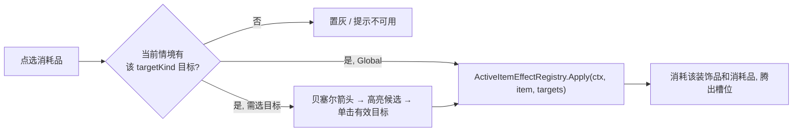

# 装饰品和消耗品设计与实现规格（装饰品 / 消耗品）

> 当前配置已拆为 `TbPassiveItem` 与 `TbActiveItem`，两张表均在运行时启用。装饰品以 ID 绑定模型并自动触发；消耗品以 `effectType + targetKind` 描述玩家主动使用的效果。
> 被动表只保留目标美味值、食物、装饰品与碎片四类常驻隐藏分修正；消耗品没有隐藏分，金币隐藏分也不接受装饰品修正。
>
> 面向策划 + 程序。定义「装饰品」与「消耗品」的概念边界、配置语法、运行时架构与落地方式。
>
> 配置源：`GameConfig/Datas/item.xlsx`（sheet `装饰品` → `TbPassiveItem`，sheet `消耗品` → `TbActiveItem`）+ `__enums_item.xlsx`（枚举）。字段速查见 [配置表说明.md](../配置表说明.md) 5.3 节。
> 结算基础见 [美味值结算.md](美味值结算.md)；随机机制见 [随机种子与随机机制说明.md](随机种子与随机机制说明.md)。

---

## 1. 一句话理解

装饰品和消耗品分两类，概念上是两种东西（参考杀戮尖塔的遗物 / 消耗品，但本项目只叫**装饰品 / 消耗品**）：

- **装饰品**：永久常驻、同 id 唯一、满足条件自动生效，**不占槽、无「使用」动作**。
- **消耗品**：一次性、占**全局消耗槽**、玩家手动使用（多数需选目标），用完腾槽。

配置已按机制物理拆为 `TbPassiveItem` / `TbActiveItem`。被动表保留 `hiddenRange`，主动表保留 `targetKind` / `targetCount` 且不配置 `hiddenRange`；消耗品是一个以「目标类型」为核心、跨情境可用的独立子系统。

---

## 2. 差异边界

| 维度 | 装饰品 | 消耗品 | 性质 |
| --- | --- | --- | --- |
| 生命周期 | 永久常驻 | 一次性，用完即毁 | 本质不同 |
| 持有语义 | 同 id 唯一，重复获得折金币 | 占全局消耗槽，槽满折金币 | 本质不同 |
| 触发方式 | 自动，满足条件生效 | 手动使用，多数需选目标 | 本质不同 |
| 作用域 | 结算管线 + 局外系统（商店/目标美味值/金币/蛋糕层数/事件概率） | 按 `targetKind` 作用于菜/格/风味/全局资源 | 两边都会外扩 |
| 品质/权重/解锁 | 配在被动表 | 配在主动表 | 结构分开但语义同源 |
| 隐藏分 | `hiddenRange`，并可修正目标美味值/食物/被动/碎片 | 不配置，抽取只按 `baseWeight` | 被动池专用 |
| 奖励/商店入口 | `PassiveItemChoice` / `ShopEntryKind.PassiveItem` | `ActiveItemGrant` / `ShopEntryKind.ActiveItem` | 接口层已分叉 |
| `effectType` 词表 | 被动词表 | 主动词表（几乎不相交） | 需按表校验 |

结论：**机制维度**（生命周期/持有/触发/效果）两类本质不同，配置和代码都按此分叉；公共字段通过 `ItemDefinition` 统一给运行时消费，主动表不再携带被动池的 `hiddenRange`。

---

## 3. 槽位模型：全局消耗槽

消耗品占**全局消耗槽**，装饰品不占槽。

- 基础槽位 **2 格**，`ExtraActiveSlot` 装饰品和消耗品可 +1 格（`ItemRuntime.ExtraActiveSlots()`）。
- 槽满时再获得消耗品 → 折金币（复用 `ItemAcquireOutcome.ConvertedToGold`）。
- 槽位数在**所有情境**统一（经营挑战 / 商店 / 地图 / 奖励界面），不再只在经营挑战 UI 生效。

>消耗品持有量由全局槽约束。装饰品只能获得一个。

---

## 4. 消耗品 = 目标类型 + 操作

### 4.1 `targetKind` 决定「能在哪用」

一张消耗品绑定一种 `targetKind`，**可用情境由 `targetKind` 自动推导，不单独配**：

| `targetKind` | 语义 | 自动可用情境 |
| --- | --- | --- |
| `DiningTableDish` | 餐桌上的菜 | 仅经营挑战；`AddFlavor` 额外限制为 Food 主界面且目标必须有食谱来源 |
| `RecipeDish` | 食谱里的菜（永久） | 任意情境含经营挑战（随时可改食谱） |
| `DiningTableCell` | 餐桌格 | 通常为可编辑情境；`AddMaterial` 额外限制为 Food 主界面 |
| `Material` | 材质 | 胃可编辑处 |
| `FlavorSlot` | 某道菜的风味槽 | 有菜可编辑处 |
| `Global` | 无目标（加钱/加天/改时间轴等） | 全情境（时间轴类限地图） |

候选枚举接口为 `EnumerateTargets(ItemDefinition item)`，因此除目标类型外还能按具体效果过滤目标。
调味与铺台小票是效果级特例：两者都只在未结算的 Food 经营挑战主界面开放。

**同类不变身**：「永久强化」与「本局强化」是两张不同的消耗品（分别 `RecipeDish` / `BoardDish`），不做同装饰品和消耗品随情境变身。

### 4.2 `targetCount`

选几个目标：`1` / `N` / `0`（全部或自动，无目标）。

### 4.3 操作（`effectType`，主动词表）

按「消耗品能干嘛」分族，全部落到 `ActiveItemEffectRegistry`：

| 族 | 操作示例 | 说明 |
| --- | --- | --- |
| 强化 | `EnhanceFlavor` / `AddScore` / `AddCountAs` | 给目标加风味/加分/加视为食物数 |
| 转换 | `ConvertCategory` / `ConvertFlavor` | 改目标美味值类/风味 |
| 增殖 | `DuplicateDish` / `GenerateDish` / `GenerateItem` | 复制/生成菜或装饰品和消耗品（需随机流） |
| 破坏 | `DestroyDish` / `RemoveFlavor` | 移除目标或其风味 |
| 资源 | `GrantGold` / `ExtraInterest` | 加金币/利息 |
| 节奏（`Global`，限地图） | `TimelineExtraDay` / `AddRewardNode` / `WeekMinus` | 改时间轴/奖励节点 |

词表里已登记的 `FlavorEnhance` / `CopyFood` / `FamilyPack` / `TimelineExtraDay` 等归位到此。

---

## 5. 配置形态

`item.xlsx` 内保留两张结构独立的数据表：

| 列 | `TbPassiveItem` | `TbActiveItem` | 说明 |
| --- | --- | --- | --- |
| `hiddenRange` | ✅ | — | 装饰品按隐藏分进池 |
| `targetKind` | — | 见 4.1 | 消耗品目标类型，进 `__enums_item.xlsx` |
| `targetCount` | — | 见 4.2 | 选几个目标 |
| `effectType` | —（以 ID 绑定模型） | 主动词表 | 被动按 ID、主动按效果类型派发 |
| `effectValue` / `effectParam` | ✅ | ✅ | 操作参数 |
| `quality` | ✅ | — | 品质只用于装饰品 |
| `baseWeight` / `specialTags` | ✅ | ✅ | 两表各自配置 |

主动 `effectType` 常量集中在 `Game/Meta/Items/ItemEffectTypes.cs`；装饰品不填写 `effectType`，每个启用 ID 必须有且只有一个对应的 `PassiveItemModel`。

---

## 6. 运行时架构

### 6.1 持有层

- 仍是一个 `List<RunItemState>`（`GameRun._items`）；被动同 id 0/1 条，主动多份受全局槽约束。
- 逻辑上暴露 `PassiveItems` / `ActiveItems` 两个视图，去掉各处零散的 `item.Kind == ...` 过滤。
- 获得入口统一 `GameRun.AcquireItem`，内部通过 `ItemDefinition` 查询 id 属于被动表还是主动表后分流。

### 6.2 被动链（现状，已成熟）

维持不动：

- 结算类 → `Game/Adapter/ItemScoreEffectAdapter.cs` → `Gameplay/Scoring/ItemScoreEffectSource.cs` 注入结算管线。
- 局级快路径 `FinalAddFlat/FinalAddMult` → `Game/Meta/Items/PassiveItemEffectRegistry.cs` → `BattleSession.FinalFlat/Multiplier`。
- 局外 hook → `Game/Meta/Items/ItemRuntime.cs`（商店/目标美味值/金币/蛋糕层数/事件概率等）。

### 6.3 主动链（需重建：跨情境 + 选目标）

关键改动：把当前死绑经营挑战的 `ActiveItemEffectRegistry.TryUse(BattleSession, item)` 解耦为吃「使用上下文」：

```csharp
// 目标：情境无关
ActiveItemUseResult Apply(IActiveUseContext ctx, ItemDefinition item, IReadOnlyList<ActiveTarget> targets);
```

- `IActiveUseContext`：经营挑战、Meta（商店/地图/奖励）各实现一个，负责「本情境有哪些 `targetKind` 目标」与「怎么把操作落到目标上」。
- 统一选目标状态机（下图）。



同一操作在不同情境的落地由 `IActiveUseContext` 区分（如 `AddScore`：`DiningTableDish` 目标改本局分、`RecipeDish` 目标永久改食谱）。

`AddFlavor` 选择桌上菜后，同时修改该 `DishInstance` 与其 `SourceDishIndex` 指向的 `RecipeBookSlot`；
`AddMaterial` 同时修改当前餐桌与当前 Run 的材质覆盖。消耗品只修改内存并消费装饰品和消耗品，不直接落盘；动画不承担数据修改，最终存档遵循既有节点。

---

## 7. 随机确定性

生成/复制类消耗品（`GenerateDish` / `DuplicateDish` / `GenerateItem`）需随机流，沿用项目命名流范式（与 `CopySkill` / `TempCopyDish` 一致：登记请求 → 注入流落地）：

- 新增 `SeedDomains.Item` 域。
- key 用 `RunSaveData` 里**单调递增的「消耗品使用序号」** `activeUseIndex`，如 `active_{activeUseIndex}`，每用一张随机装饰品和消耗品 +1。
- 保证同种子 + 同玩家输入下，第 K 次使用抽到的东西可复现。
- **选目标是玩家输入，不占随机流**，天然确定。

---

## 8. 存档

- 沿用 `RunSaveData.Items`（`List<RunItemSaveData>`），主动多份 = 多条同 `ItemId`。
- 新增 `activeUseIndex`（消耗品使用序号，见第 7 节）。
- 全局槽数为派生值（基础 2 + `ExtraActiveSlot`），不入档。

---

## 9. 落地清单（分阶段）

1. ✅ **配置**：`item.xlsx` 已拆成 `装饰品` / `消耗品` 两张 sheet；`TbPassiveItem` 有 `hiddenRange`，`TbActiveItem` 有 `targetKind` / `targetCount` 且不使用隐藏分；生成 `PassiveItem.cs` / `ActiveItem.cs`。
2. ✅ **槽位**：`GameRun.BaseActiveSlots`(2) + `ActiveSlotCapacity`(= 基础 + `ExtraActiveSlot`) + `ActiveItemCount`/`HasFreeActiveSlot`；`AcquireItem` 主动分支改为「槽满折金币」；`BattleWorldController` 改为逐实例按容量渲染。
3. 🚧 **主动子系统**：已完成 C# 核心——`IActiveUseContext` + `ActiveTarget`、`BattleUseContext`、`ItemActiveUsage`（targetKind→情境/选目标推导）、`ActiveItemEffectRegistry.Apply(ctx,item,targets)` 情境无关派发（`TryUse` 保留为经营挑战便捷入口）。**待办**：主动表填数据后接 Meta（商店/地图/奖励）情境实现 + 选目标状态机/UI。
4. ✅ **随机**：`SeedDomains.Item` + `RunSaveData.ActiveUseIndex`（存档字段）+ `GameRun.NextActiveUseKey()`（单调 `active_{n}`，存读档保序）。
5. ✅ **持有视图**：`GameRun.PassiveItemStates` / `ActiveItemStates` 暴露，`BattleWorldController` 已改用。
6. 🚧 **测试**：已写 `ItemActiveTests`（槽满折金币、加槽、使用序号可复现、targetKind 推导、Apply 派发），dotnet 编译通过；**待 Unity 编辑器实跑**（当前 Unity MCP 未连通）。

---

## 10. 出处与引用

- 现有实现：`Game/Meta/Items/`（`ItemRuntime` / `PassiveItemEffectRegistry` / `ActiveItemEffectRegistry` / `ItemPoolService` / `ItemEffectTypes` / `ItemAcquireResult`）、`Game/Run/GameRun.cs`（`AcquireItem` / `UseActiveItem`）、`Game/Run/RunItemState.cs`、`Game/Adapter/ItemScoreEffectAdapter.cs`、`Game/Run/BattleSessionFactory.cs`、`Game/Presentation/Battle/BattleWorldController.cs`、`Game/UI/Battle/View/BattleItemsColumn.cs`。
- 配置：`GameConfig/Datas/item.xlsx`、`__enums_item.xlsx`；生成物 `Assets/GameMain/Scripts/Config/Gen/PassiveItem.cs`、`ActiveItem.cs`、`ItemKind.cs`。
- 相关规范：[luban-config-code-sync.mdc](../../.cursor/rules/luban-config-code-sync.mdc)、[随机种子与随机机制说明.md](随机种子与随机机制说明.md)。
